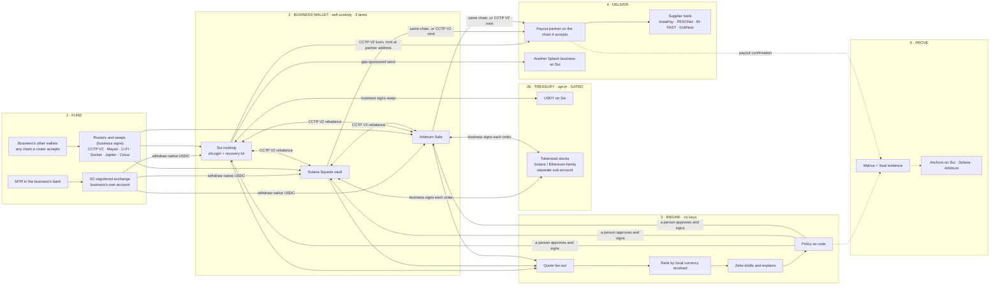
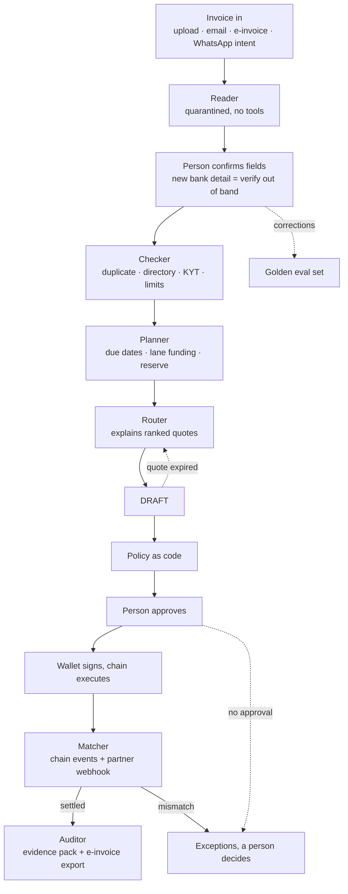

# Splash Business Module v15.1

**Status: CANON (locked 11 Oct 2026).** Sky's trigger, 11 Oct: "update a solid v15.1 (not a draft)". v15.1 supersedes v14 (22 Sep 2026) and v15 (4 Oct). Every Move change still needs Sebastian's written sign-off before it ships, and items tagged GATED or UNCONFIRMED stay that way until their check passes: locking the module does not make an unverified fact true.
**Date:** 10 Oct 2026, locked 11 Oct with §14 (Sky's decisions after the competitor teardown) · **Companion docs:** `splash/design-brief_pay-flow_v15.1_2026-10-11.md` (UI and flow), `splash/sebastian-brief_transfer-zeke-treasury_2026-10-10.md` (build), `splash/competitor-partner-teardown_2026-10-11.md` (evidence) · **Builds on:** Business Module v15 complete (4 Oct, `splash/business-module-v15-complete-2026-10-04.md`). **Sections not listed below are unchanged from v15** and still apply word for word: §2 cast (except the new rows in §2.1 here), §4.1 onboarding, §4.2 KYC tiers, §4.4 wallet and recovery kit, §4.7 evidence, §8 moat, §12 panel.
**What triggered v15.1 (Sky, 8 to 10 Oct):**
1. Circle added Sui to CCTP V2 (release note 8 Oct; supported-chains table confirmed 10 Oct).
2. Treasury comes back as an option for idle balances: Ondo USDY on the Sui lane; tokenized stocks on the Ethereum-family and Solana lanes, with Treasures (treasures.io) as the planned partner.
3. Sky asked for the full transfer flow and the Zeke loop written out.

Status key used throughout: **BUILT** (in the repo or on mainnet, per earlier canon) · **DESIGNED** (specified in v15, not confirmed built) · **NEW** (added in v15.1) · **GATED** (blocked until a named check passes) · **UNCONFIRMED** (fact not yet verified).

---

## 0. Stress test of the 10 Oct changes

**What holds**
- **CCTP V2 on Sui is real and it helps.** Circle's supported-chains table lists Sui with Standard Transfer as a source; only Noble is still V1-only. Circle charges no fee for Standard Transfer. Sui stops being a dead end on 1 December, and a Sui-home business can pay out with one burn on Sui and a mint at the partner's deposit address, with no solver or pool bridge.
- **USDY on the Sui lane is the right first treasury asset.** It is issuer-backed (short-term US Treasuries and bank deposits), already on Sui, and transfers permissionlessly between wallets after the 40-day lock on fresh mints. It was also the only Save asset in earlier canon ("Save: variable-yield treasury, Ondo USDY only").
- **Self-custody makes treasury cleaner than it was in v14.** In v14, treasury meant Splash holding client value (`splash_custody`, licence-gated). In v15.1 the business buys an asset in its own wallet and signs it. Splash still holds nothing.

**What breaks, and the fix**

| # | What Sky said | Where it breaks | Fix in v15.1 |
|---|---|---|---|
| 1 | "Sui is V2 CCTP, so it will be better" | True for moving USDC. It doesn't create a payout partner: none takes USDC on Sui. And the mint on Sui isn't gas-free (it calls Circle's package), and Circle has no Forwarding Service into Sui | Sui-sourced payouts now use a direct CCTP V2 burn to the partner's chain. Inbound mints on Sui are relayed and gas-sponsored by Splash. Payout partners still decide the delivery chain (§4.5) |
| 2 | "Ondo told us USDY is permissionless" | Transfers are permissionless after the 40-day lock on fresh mints. **US persons still can't acquire or hold it** under Ondo's terms. It is a **tokenized note**, not a stablecoin, and its price moves (it accrues). Liquidity on Sui is thin (about US$14.3M of USDY on Sui in Aug 2026) | Eligibility gate on every USDY action (no US persons among company, UBOs or signers). Buy and sell through Sui DEX routes with price impact shown; size cap per order. Never used for payouts: swap back to USDC first (§4.9) |
| 3 | "Tokenized stocks on Eth and Solana lanes, partner treasurers.io" | The site found is **treasures.io** (Treasures Finance), confirm the name. Tokenized stocks are securities-like instruments (xStocks are tracker certificates issued by Backed; Ondo stocks are total-return trackers). xStocks are restricted in the US, UK, Canada and Australia; Ondo adds investor-qualification rules; Malaysia is not confirmed either way. Treasures holds a **standing trading permission** on the user's wallet, which conflicts with "no third-party key on the vault" | **GATED behind counsel (K17, K18).** If cleared: trades are signed by the business per order, with no standing permission on the Squads vault or Safe; stocks sit in a separate treasury sub-account, never the payables vault (§4.9) |
| 4 | Treasury as a selling point | Claims discipline: never claim yield as live, never state a fixed APY. Payables money in Nvidia is a CFO risk, and the pitch drifts from "pay suppliers, prove everything" towards a crypto neobank | Treasury is **off by default**, framed as "idle balance options", with a payables reserve rule. The APY is shown live-pulled and labelled variable. Not on the Colosseum or Basecamp decks |
| 5 | Zeke and treasury | v15 Planner rule: "can never propose yield". Recommending a specific security can be investment advice | Planner may **show** options and reserve status from live data. It never recommends a specific asset, never states a fixed rate, never moves funds (§4.8) |

**One-line model (v15.1):** *Splash is self-custodial settlement software. Businesses hold USDC on Sui, Solana and Arbitrum, which now all move natively through CCTP V2; Splash's engine races those lanes to a payout partner on whatever network that partner accepts; Zeke drafts, a person approves; every payment leaves an encrypted, anchored evidence record. Idle balances can, at the business's own choice, sit in USDY on Sui (and later tokenized stocks), always in its own wallet.*

---

## 1. What v15.1 changes against v15

| # | v15 (4 Oct) | v15.1 (10 Oct) | Status |
|---|---|---|---|
| 1 | Sui is CCTP V1-only; Mayan MCTP from Sui dies 1 Dec | Sui is on CCTP V2 (Standard Transfer). Direct V2 adapter adds Sui as source and destination; `cctp_v1` becomes a legacy flag | NEW, Splash test pending |
| 2 | Sui-sourced payouts win only on a near-tie | Unchanged rule. Sui-sourced payouts now have a native route, so the home-lane rule applies to real quotes instead of a Mayan-only path | NEW |
| 3 | Lane rebalancing via Mayan for Sui | Rebalancing between all three lanes via CCTP V2; Mayan Swift stays a fallback | NEW |
| 4 | Treasury: none in v15 ("Save" removed from landing) | **Treasury (opt-in):** USDY on Sui lane (GATED by K17); tokenized stocks on Ethereum-family and Solana lanes via Treasures (GATED by K17, K18, K19) | NEW, GATED |
| 5 | Zeke Planner: never proposes yield | Planner shows treasury options and the payables reserve; never recommends, never moves funds | NEW |
| 6 | 31 Oct gate: "Circle lists Sui on V2" | 31 Oct gate: Splash's own Sui V2 routes pass live tests at US$100, 1,000 and 10,000 | NEW |
| 7 | I7: USD stablecoins a partner accepts | I7 unchanged for **payables balances**. Treasury assets are a separate class: never counted as payables balance, never paid out directly | NEW wording |

---

## 2.1 Cast: new and changed rows (rest of §2 unchanged)

| Actor | Role | Touches money? | Holds a key to client money? | Status |
|---|---|---|---|---|
| Circle (CCTP V2, Sui domain 8) | Burn on the source chain, attestation, mint on the destination | Issuer | No | Live per Circle docs; Splash untested |
| Splash relayer (Sui) | Submits `receive` mints on Sui for inbound CCTP V2 transfers and pays the gas (Sui has no Circle Forwarding Service) | Gas only | **No.** It submits Circle's signed message; the mint goes to the business's address | NEW, to build |
| Ondo Finance (USDY) | Issuer of USDY, a tokenized note secured by short-term US Treasuries and US bank deposits | Issuer | No | Candidate; Sky reports Ondo says permissionless |
| Sui DEXes (Cetus, 7K, Aftermath) | USDC ↔ USDY swaps on Sui, signed by the business | Pass-through | No | Self-serve; USDY depth UNCONFIRMED |
| **Treasures (treasures.io)** | Routes stablecoin orders to tokenized stocks across tokenizers (Ondo Global Markets, xStocks, others) and chains (Solana, Ethereum, Base, Arbitrum per its site) | Pass-through | **Its standard model holds a trading permission.** v15.1 requires per-order signing instead | Candidate; name to confirm (Sky wrote "treasurers.io") |
| Tokenizers (Ondo Global Markets, Backed/xStocks) | Issue the stock-tracking tokens | Issuer | No | Candidate, never named externally |

---

## 3. The whole system in one picture

**Reading it:** solid lines are money and always start from the business's own wallet with its signature. Treasury assets never go to a payout partner directly; they come back to USDC first.

---

## 4.3 Fund the wallet (replaces v15 §4.3 route table; controls unchanged)

**Flow:**
1. **Ringgit in.** The business buys USDC on its own account at an SC-registered Malaysian exchange (HATA, Luno, MX Global, SINEGY, Kinetic) and withdraws native USDC to its Splash address on Sui, Solana or Arbitrum. Splash never touches MYR. (DESIGNED; exchange withdrawal networks per exchange UNCONFIRMED.)
2. **Crypto in.** The business connects an outside wallet. The engine quotes routes into the lane the business picks (or the cheapest lane for its next payout). The business signs.
3. **Controls:** destination locked to the business's own address; only native USDC or USDT on the allowlist; both addresses screened; exact-amount approvals on EVM; price impact and quote expiry shown for volatile assets.
4. **Splash fee on funding: 0.** Route cost at cost.

| Source | Lands in | Route | Status |
|---|---|---|---|
| USDC already on Sui | Sui | Deposit QR | BUILT (Sui lane) |
| USDC on Solana or Arbitrum, into Sui | Sui | **CCTP V2 Standard Transfer**, mint relayed by Splash on Sui (gas sponsored); Mayan Swift fallback | NEW, test pending |
| USDC on Ethereum, Base, Polygon | Arbitrum or Solana (CCTP V2 Fast Transfer), or Sui (CCTP V2 Standard) | Direct CCTP V2, or LI.FI/Socket when a swap is needed | NEW for Sui |
| USDsui, SUI | Sui | Swap to USDC (Cetus/7K/Aftermath) | DESIGNED |
| SOL, USDT on Solana | Solana | Jupiter | DESIGNED |
| ETH, other EVM assets | Arbitrum | LI.FI/Socket (LI.FI 0.25% shown) | DESIGNED |
| MYR | Any lane | SC-registered exchange withdrawal | DESIGNED |

---

## 4.5 Send: the route engine (replaces v15 §4.5 step 2, the build table and the gate; the rest of v15 §4.5 stands)

**Step 2, candidate routes (v15.1):** sources are the three lanes. For each target the payout partner accepts:
- **Same chain:** no bridge; send to the partner's one-payment deposit address.
- **CCTP V2 direct** from any lane, including **Sui (new)**, with `mintRecipient` = the partner's deposit address on Solana, Arbitrum, Polygon, Base or Ethereum. Fast Transfer where the source supports it (Solana, Arbitrum); Standard from Sui (Circle lists Fast as N/A for Sui).
- **Mayan Swift** (solver, up to about US$1M per order): fallback, flagged `solver_bridge`.
- **Mayan MCTP over V1:** legacy only, flagged `cctp_v1`, allowed until 31 Oct, deprioritised 31 Oct to 30 Nov, removed 1 Dec (Circle: V1 deprecation begins 31 Oct, completes 1 Dec).
- **LI.FI / Socket:** only when a real swap is needed.

**Safest policy (v15.1):** same-chain first, then CCTP V2 burn-and-mint, then nothing else.

**Which lanes are live in which build (v15.1):**

| Build | `ENGINE_HOME_CHAIN` | `ENGINE_LANES` | Payout path |
|---|---|---|---|
| Sui main (Basecamp) | `sui` | `sui,solana,arbitrum` | Sui balance → CCTP V2 burn on Sui → mint at partner address (new); or Solana/Arbitrum balances directly |
| Solana (Colosseum, 12 Oct) | `solana` | `solana` | Solana direct, or CCTP V2 mint to Polygon; no Sui in the judged flow |
| Arbitrum | `arbitrum` | `arbitrum` | Arbitrum direct, or CCTP V2 mint to Polygon |

**`RouteQuote` flag change:** add `'cctp_v2'` and `'relayed_mint'`; keep `'cctp_v1'` as legacy until 1 Dec.

---

## 4.6 Deliver (v15 §4.6 stands, with one addition)

- **Invariant unchanged:** a payout's on-chain destination is the business's own address or the partner's one-payment deposit address. Never a Splash address, never a treasury asset.
- **NEW:** when the payout is funded from Sui, the burn happens in the business's own Sui transaction and the mint lands directly at the partner's address. Splash's relayer only submits the attestation.

---

## 4.8 Zeke: the full loop (replaces v15 §4.8; the six agents and the authority boundary stand)

**Agents (unchanged):** Reader (quarantined, no tools) · Router · Checker · Planner · Matcher · Auditor. Models: `claude-sonnet-5-5` runs the agents; `claude-haiku-4-5-20251001` second-pass verifier (retiring no sooner than 15 Oct 2026, pin a replacement); `claude-opus-5-5` grades offline evals.

**Authority boundary (unchanged):** Zeke's only output is a draft. Policy runs as code. A person approves. The chain executes from the business's wallet. Zeke holds no key.

**The loop, invoice in to evidence out:**
1. **Intake.** An invoice arrives by upload, forwarded email, e-invoice import (MyInvois UUID or BIR reference), or WhatsApp capture (intent only, never authority).
2. **Reader, in quarantine.** Extracts supplier, amount, currency, due date, bank details and invoice number to validated JSON. No tools, so instructions inside a PDF can't do anything.
3. **Person confirms fields.** Every extracted field is shown. A new or changed bank detail is never payable until verified out of band (a call-back or the supplier's own Splash account).
4. **Checker.** Duplicate-invoice hash, supplier directory match, KYT on any wallet, tier and limit pre-check. Output: "will pass" or "will fail because…".
5. **Planner.** Looks at due dates and balances by lane (and treasury, if on). Suggests batching, which lane to fund, and whether the payables reserve is short. If the reserve is short and the business holds USDY, it shows "sell X USDY to cover" as an option. It never recommends an asset or states a fixed rate.
6. **Router.** Explains the engine's ranked quotes in plain words: "Cheapest: supplier receives PHP 560,000, all-in 0.29%, arrives same banking day."
7. **Draft.** One payment or a batch (Sui can batch a whole payment run into one transaction).
8. **Policy as code.** Tier, limits, KYT, duplicate check, quote expiry. Deterministic; Zeke can't override it.
9. **A person approves.** zkLogin or passkey; the second approver co-signs in two-signature mode.
10. **Execute.** The business's wallet signs. Splash relays only.
11. **Matcher.** Watches chain events and the partner's signed webhook until the payout is settled or flagged. A mismatch is never closed by Zeke.
12. **Auditor.** Builds the evidence pack (invoice, approval chain, quote vs executed route, every digest, FX rate, partner payout id, bank reference) and the MyInvois/BIR export. The user shares it; Zeke grants no access.

**The loops inside the loop:**
- **Re-quote loop:** if a quote expires or `minOut` moves more than 5 bps before signing, the engine re-quotes and the person confirms again.
- **Approval loop:** unapproved drafts get reminders; drafts past due date go to an exceptions list, never auto-execute.
- **Settlement loop:** Matcher polls until `DST_SETTLED`, `REFUNDED`, `FAILED` or `PARTIAL_EXCEPTION`; exceptions go to a person.
- **Learning loop:** every field a person corrects becomes a case in the golden eval set. The eval gate (poisoned PDF, changed bank details, prompt injection) must show zero unauthorised actions before any release.
- **Treasury loop (opt-in, GATED):** once a day the Planner compares idle balance against upcoming payables and shows the gap. It drafts nothing on its own; the business starts any treasury move.
- **x402 loop (BUILT in repo, deployment UNCONFIRMED):** a site answers "payment required", Zeke reads and explains the price, a person approves and signs from the business wallet inside the same spending limit. Zeke paying by itself waits on a signed on-chain spending mandate (PLANNED, Move, Sebastian).

---

## 4.9 Treasury: idle balance options (NEW, GATED)

**Principle:** treasury is the business's own investment decision, in its own wallet. Splash shows options and builds the transaction; the business signs every move. Off by default. Never part of the payables balance. Never paid out directly.

**Gates before any treasury feature reaches a customer:**
- **K17 (counsel, Malaysia):** does showing and routing USDY or tokenized stocks to Malaysian businesses make Splash a dealer, adviser or digital-asset operator under the CMSA and the SC's digital-asset rules?
- **K18 (counsel):** are tokenized stocks (tracker certificates, total-return trackers) allowed for Malaysian, Philippine and Indonesian companies at all?
- **K19 (partner):** can Treasures execute per-order, business-signed trades with no standing trading permission on the Squads vault or Safe?
- **Eligibility gate (all treasury):** block if the company, any UBO ≥ 25% or any signer is a US person, or the company sits in a jurisdiction the issuer restricts (xStocks: US, UK, Canada, Australia, sanctioned; Ondo: US plus its own list).
- **Copy gate:** no fixed APY anywhere; rates live-pulled and labelled "variable, not guaranteed"; "treasury" never appears on Colosseum or Basecamp decks.

**4.9.1 Sui lane: Ondo USDY**

| Item | Rule |
|---|---|
| What it is | A tokenized note issued by Ondo USDY LLC, secured by short-term US Treasuries and US bank demand deposits. Not a stablecoin; its price accrues over time |
| Access | Buy and sell on Sui DEXes (Cetus, 7K, Aftermath), signed by the business. Fresh mints carry a 40-day transfer lock; secondary transfers are permissionless after that. Ondo's terms bar US persons |
| Where it sits | The business's own Sui multisig, same members and recovery kit as payables |
| Payables reserve | The business sets a reserve (default: the next 30 days of approved payables plus 10%). Treasury buys can't take USDC below it |
| Size cap | Per-order cap set from live pool depth so price impact stays under 0.30%; above that, split or decline |
| Exit | Swap USDY → USDC before any payout; the route engine never sources a payout from USDY |
| Rate shown | Live-pulled from Ondo, labelled variable. (Ondo's page showed 3.60% in a May 2026 third-party write-up; never print a number in copy) |
| Fee | Splash fee 0 until counsel clears K17 |
| Status | GATED (K17, eligibility gate, pool-depth check). Earlier canon conflict: one third-party source says USDY rebases daily; canon (Aug 2026 brief) records USDY trading around US$1.14, which fits an accruing price. Confirm with Ondo's docs |

**4.9.2 Solana and Ethereum-family lanes: tokenized stocks via Treasures**

| Item | Rule |
|---|---|
| What it is | Tokens that track listed stocks or ETFs (xStocks: tracker certificates by Backed Assets (JE) Ltd, on Solana; Ondo Global Markets: total-return trackers). Not direct share ownership |
| Partner | Treasures (treasures.io): routes USDC orders across tokenizers and chains; self-custodial, but its default model holds a trading permission |
| Splash rule | No standing permission on the payables vault or Safe. Either per-order signing by the business, or a **separate treasury sub-account** (its own Squads vault or Safe, same people, no Treasures permission on the payables account) |
| Volatility | Shown as an equity risk, not a cash equivalent. Never counted toward the payables reserve |
| Exit | Sell to USDC on the same lane; route engine never sources a payout from stocks |
| Fee | Splash fee 0 until counsel clears K17 and K18 |
| Status | GATED (K17, K18, K19, eligibility). Not before 10 paying payment customers |

**Brutal read on treasury:** USDY is a reasonable "idle cash" feature once counsel clears it. Tokenized stocks are a different business: securities exposure, equity risk on payables money, and a pitch that drifts from B2B payments to a crypto neobank. Investors will read it as lost focus unless payment volume already exists. Keep stocks as a later, partner-led option.

---

## 5. Fees (v15 §5 stands, with these rows added)

| Flow | Price | Note |
|---|---|---|
| Rebalancing between lanes (CCTP V2 Standard) | Circle 0; Splash 0; network gas at cost (Sui mint gas sponsored by Splash) | NEW |
| CCTP V2 Fast Transfer (Solana, Arbitrum sources) | Circle's variable Fast fee at cost; Splash 0 | NEW |
| Treasury buy or sell (USDY, stocks) | Route at cost; Splash 0 until counsel | NEW, GATED |

---

## 6. Chains (replaces the Sui row and the 31 Oct gate)

| Network | Role | v15.1 change |
|---|---|---|
| Sui | Home lane: accounts, approvals, gas-sponsored Splash ↔ Splash, evidence; **payout source via CCTP V2 burn**; USDY treasury | Sui is no longer V1-bound |
| Solana | Lane: primary payout source; tokenized stocks (GATED) | — |
| Arbitrum | Lane: PDAX direct; tokenized stocks via Treasures if the Arbitrum listing holds (GATED) | — |
| Polygon, Base, Ethereum | Delivery networks only (CCTP V2 mints) | Ethereum and Base may also be treasury venues if Treasures routes there; no Splash payables wallet |

**31 Oct gate (v15.1):** keep Sui-sourced payouts only if Splash's own CCTP V2 burns from Sui pass live tests at US$100, 1,000 and 10,000 to Solana and Arbitrum deposit addresses, and inbound mints relayed on Sui pass. Otherwise payouts fund from Solana or Arbitrum balances and Sui keeps the record.

---

## 7. Compliance additions

- Risk disclosures add: treasury assets are not stablecoins; USDY price can fall; tokenized stocks carry equity risk and are not direct share ownership; issuers restrict who can hold them.
- **K17, K18** added to the counsel brief (see §13).
- The Trust and Compliance page keeps: "Splash is not yet a licensed money-services business." Add: "Treasury options are the business's own investments in its own wallet. Splash doesn't hold, manage or advise on them."

---

## 9. ADRs added (Proposed; deciders Sky + Sebastian)

**ADR-15.1-01 · CCTP V2 is the default cross-chain rail on all three lanes**
- **Context:** Circle listed Sui on CCTP V2 on 8 Oct; V1 deprecation runs 31 Oct to 1 Dec.
- **Decision:** direct CCTP V2 burn-and-mint for lane rebalancing and payouts from Sui, Solana and Arbitrum. Mayan Swift as fallback. V1 removed by 1 Dec.
- **Consequences:** fewer third parties in the money path; Splash runs a Sui mint relayer and pays its gas; Standard Transfer from Sui settles at Sui finality, no Fast option.

**ADR-15.1-02 · Treasury is opt-in, in the business's own wallet, with a payables reserve**
- **Options:** A: no treasury (v15). B: Splash-managed treasury (v14 `splash_custody`, licence-gated). C: business-signed, opt-in, reserve-protected, counsel-gated. **Chosen: C.**
- **Consequences:** no custody; eligibility and copy gates; zero Splash fee on treasury until counsel.

**ADR-15.1-03 · No standing third-party trading permission on a payables account**
- **Decision:** any partner that needs delegated trading (Treasures) gets it only on a separate treasury sub-account, or not at all.
- **Consequence:** one more vault or Safe per business that opts into stocks.

---

## 10. Risks added

| Risk | Likelihood | Kill? | Mitigation |
|---|---|---|---|
| CCTP V2 on Sui works on paper, fails in Splash's flow (relayer, attestation timing) | Low–medium | No | 31 Oct live tests; Mayan Swift fallback; fund from Solana/Arbitrum |
| Counsel says treasury makes Splash a dealer or adviser | Medium | No (feature dies, not the company) | Gate K17; zero fee; link-out instead of in-app |
| USDY liquidity on Sui too thin | Medium | Feature | Size caps from live depth; split orders |
| A US person slips through the eligibility gate | Low | Trust/legal | KYB UBO nationality and residency checks; block on doubt |
| Treasury distracts from payments traction | High | Fundraise | Not on decks; build after 10 paying customers |

---

## 11. Dated plan (v15.1 additions)

| By | What | Owner |
|---|---|---|
| 12 Oct | Colosseum: Solana-only flow; no treasury, no Sui | Sky, Sebastian |
| 17 Oct | CCTP V2 Sui adapter: mainnet tests US$1–5 Sui → Solana and Sui → Arbitrum; inbound relayed mint; digests recorded | Sebastian |
| 20 Oct | Counsel brief adds K17, K18; Treasures K19 question sent in writing | Sky |
| 24 Oct | Engine v1 with CCTP V2 on all three lanes; Mayan Swift fallback | Sebastian |
| 31 Oct | **Gate:** live tests at US$100, 1,000, 10,000 | Sebastian |
| 1 Dec | No route depends on CCTP V1 | Sebastian |
| After 10 paying customers and counsel clearance | USDY treasury beta on Sui | Sky, Sebastian |
| Later | Tokenized stocks via Treasures, separate sub-account | Sky, Sebastian |

---

## 13. Registers (additions)

**K-register:**
- **K17:** treasury features (USDY, tokenized stocks) under the CMSA and SC digital-asset rules: dealer, adviser or operator?
- **K18:** may Malaysian, Philippine and Indonesian companies hold tokenized stocks (tracker certificates) at all?
- **K19:** can Treasures execute per-order, business-signed trades with no standing permission?
- **K20:** USDY mechanics on Sui (accruing vs rebasing, lock on secondary buys, pool depth) confirmed from Ondo's own docs.

**D-log:**
- **D15 (new, Sky 8–10 Oct):** CCTP V2 on Sui makes multichain USDC the default; direct V2 burn-and-mint on all lanes.
- **D16 (new, Sky 10 Oct):** treasury returns as an opt-in: USDY on the Sui lane; tokenized stocks on the Ethereum-family and Solana lanes via Treasures. UNCONFIRMED until counsel and the v15.1 trigger.

**Open for Sky:**
1. ~~Trigger v14 → v15.1~~ Done, 11 Oct.
2. Confirm the partner name: treasures.io (Treasures Finance) or a different "treasurers.io".
3. Get Ondo's "permissionless" statement in writing, including the US-person rule and any lock on secondary buys.
4. Ask Sui Foundation how apps get Sui Threat Intelligence signals (§14.7).
5. Send AEON the 14 written questions (`competitor-partner-teardown` notes).

---

## 14. Decisions locked 11 Oct 2026 (Sky, after the competitor teardown)

### 14.1 Approval rule (Sky: "do what we already discussed and confirmed")
- **Every supplier payout gets a fresh human signature** on a closed transaction (zkLogin or passkey; the second approver co-signs in two-signature mode). No threshold, no auto-pay, no AUTO_EXECUTE. This is the confirmed canon from v15 §4.8 and the Basecamp script.
- **Mandates exist only for x402 / paid-API spend** (PLANNED): a person pre-signs a bounded budget; Zeke spends inside it. Never used for supplier payouts.
- External wording: "Zeke drafts, a person approves." For the mandate: "a person pre-approves a limited budget." Never "autonomous" or "no human approval".
- **Why not AEON's model:** AEON's published card ("Approval above $1,000") lets an agent pay up to $1,000 with nobody approving. That is the behaviour Splash's invariant forbids.

### 14.2 AEON (Sky: "design brief and also the flow")
- Take AEON's visual grammar, not its rules: one idea per card, task-scoped agent rows, rules written as sentences, route cards with time and fee lines, secrets kept out of model context, verify state before any retry.
- The full brief and screen-by-screen pay flow: `splash/design-brief_pay-flow_v15.1_2026-10-11.md`.
- AEON itself: **neither competitor nor partner, watch list.**

### 14.3 Vietnam (Sky: "future expansion, not now, plan")
- Vietnam is a **planned future corridor**, not in v15.1 scope. Corridors stay MY → PH first, MY → ID second.
- Conditions to open Vietnam: (a) a payout partner with a written, regulator-checkable licence or a named licensed Vietnamese bank; (b) a Vietnamese legal opinion that a VND payout funded from USDC is lawful for the recipient; (c) at least three Malaysian customers asking for VN suppliers; (d) MY → PH live with real volume.
- AEON Pay is not a candidate until it answers the written questions with documents (§14.8).

### 14.4 Who can change Zeke's policy (Sky: "the main primary user, the highest authority or the person appointed by the company")
- **Policy authority = the Company Authority**: the person the company appoints as its highest authority on Splash (a director or officer named in the KYB documents or a board resolution). By default this is the admin who onboarded the company; the company can reassign it.
- **Zeke can never change policy**; it can only suggest a change for the Company Authority to approve.
- **Safeguards added (Claude's recommendation inside Sky's decision; Sky can remove them):**
  - Loosening changes (raising a limit, adding an allowed supplier, adding a mandate, turning off two-signature mode) need a passkey step-up, take effect after a **24-hour cooling-off**, and notify every member and approver. Tightening changes apply at once.
  - Every policy change is written to the evidence record (who, what, before/after, when it took effect).
  - Reason: a single person's stolen login should not be able to raise limits and pay in one sitting.
- Reassigning the Company Authority itself follows the same loosening rule.

### 14.5 Mandate (Sky: "build our own")
- Splash builds its own Move mandate package (`splash_mandate`, PLANNED, Sebastian sign-off) rather than depending on Sui Agent Payments (testnet-only, invite-only on 11 Oct).
- Design (from the teardown):
  - funds escrowed inside the mandate (`Balance<USDC>`), so grants can't promise more than exists;
  - bound to Zeke's delegate address (`ctx.sender() == mandate.delegate`), no bearer capability;
  - one allowed counterparty per mandate, set only by a person;
  - per-payment cap, total cap, period (daily or weekly) cap;
  - short expiry; renewal is a new human signature;
  - revoke by the owner at any time; optional Splash pause key, separate from withdraw;
  - test that revoke and spend sent at the same moment resolve safely.
- Stay compatible in shape with Sui's agent grant model so a later switch is cheap.

### 14.6 Zeke capabilities and the Colosseum headline (Sky: "you decide; extend Zeke to myStableCorp-level capabilities")
- **Decision on the headline:** lead with founder-market fit and the paper trail, not the AI. Colosseum judges have already seen an agent draft an invoice (myStableCorp's promo). One-line opener: *"I spent years in banking and trade watching finance teams chase proof of payment. Splash pays suppliers abroad in USDC and leaves the paper trail an auditor asks for."* Then show the approval card Zeke can't touch.
- **Zeke capability roadmap ("Talk to your business"), every action draft-only:**

| Capability | What the user types or does | What Zeke produces | Status |
|---|---|---|---|
| Pay a bill | Upload or forward an invoice | Payment draft with ranked routes | DESIGNED (v15 §4.8) |
| Batch a payment run | "Pay everything due this week" | Batch draft, one approval | DESIGNED |
| Send an invoice (receivables) | "Invoice Manila Freight 4,200 USD for September" | Invoice draft with a USDC payment link and the e-invoice reference; the user presses Send | NEW, PLANNED |
| Add a supplier | "Add Cebu Logistics" | Supplier invite; bank details verified out of band before first payment | NEW, PLANNED |
| Ask about money | "What do we owe in PHP this month?" | Answer from balances and payables | NEW, PLANNED |
| Export for the auditor or tax | "Give me September's evidence pack" | Pack plus MyInvois / BIR export | DESIGNED |
| Reconcile | Automatic | Matched or mismatch flags | DESIGNED |
| Pay for an API (x402) | Automatic within a mandate | Spend inside a person-signed budget | BUILT path (person signs); mandate PLANNED |
| Company setup | Out of scope. Possible later referral partner (e.g. myStableCorp for US entities) | — | Not planned |

- Design rule: every capability ends on the same approval card (§4 of the design brief). Zeke never sends, pays or edits policy.

### 14.7 Sui Threat Intelligence (Sky: "I think it's mainnet; integrate on the Sui main build")
- **What is verified (11 Oct):** Sui introduced "Sui Threat Intelligence" at Basecamp on 7 Oct: monitoring for suspicious wallets, exploits, malicious actors and risky contracts, with "detection to automated containment" and "sharing security tools with builders". **No public API, feed, docs or app integration was found**, and mainnet status for builders isn't stated (a Sui community post said "the big thing is coming").
- **Plan for the Sui main build:**
  1. Sky asks the Sui Foundation (Sui Community Malaysia channel) for builder access: how apps receive signals, and whether Splash's packages (`splash_core`, `splash_evidence`, later `splash_mandate`) can be enrolled for monitoring.
  2. Sebastian adds a `threat-signals` adapter behind the existing KYT gate: before any transaction is built, check the recipient, the funding source and any contract touched. **Fail closed** on a high-risk signal; show the reason.
  3. Until Sui's feed exists, use what is live: the pay-per-check KYT vendor (upgrade to Elliptic later, per 4 Oct decision), and evaluate Webacy's Sui address-risk API (upgraded July 2026) and TRM's Sui coverage.
  4. Every screening result goes into the evidence record.
- Claims: say "screened before every payment". Don't say "protected by Sui Threat Intelligence" until the integration exists.

### 14.8 Partner register after the teardown (none signed; never named externally)

| Entry | Role | Status |
|---|---|---|
| Noah | Off-ramp MY/PH/ID | Candidate |
| PDAX | PH payout | Candidate, in conversation |
| GCash / GCrypto | PH | Candidate (canon: PHP business remittance capability confirmed) |
| DurianPay | ID payout | Candidate, pilot planned |
| Coins.ph | PH payout | Candidate, **no contact yet** |
| AEON Pay | 2nd PH partner, VN later | **Prospect: no-go until documents.** No licence found in any jurisdiction; public product is consumer QR acquiring with no B2B payout API |
| AEON's unnamed PH settlement bank | Possible direct PH counterparty | To identify |
| MonFi (Monfi Digital Bank Ltd, Labuan licence 230148DB, verified in gazette P.U.(B) 118/2026) | Offshore USD account only | Prospect, low priority; crypto approvals unverified; not a MYR on-ramp |
| myStableCorp | Possible referral (US LLCs paying ASEAN suppliers) | Not contacted |
| Treasures | Tokenized stocks | Candidate, GATED (K17–K19) |
| Ondo (USDY) | Sui treasury asset | Candidate, GATED (K17, K20) |

### 14.9 Claims added
- Never: "partnered with AEON", "VAA-integrated", "verified by Google Cloud", "built on Sui Agent Payments", "protected by Sui Threat Intelligence", "FIRA-equivalent", "autonomous payments".
- Allowed: "Our evidence design follows the same pattern Mysten described for VAA" (design similarity only); "the paper trail your bank and auditor ask for"; "screened before every payment".
- No traction number goes out unless Splash can show its source on request. No placeholder stats on any live page.

Sources: [Circle supported chains](https://developers.circle.com/cctp/concepts/supported-chains-and-domains.md), [Circle CCTP page](https://www.circle.com/cross-chain-transfer-protocol), [Circle migration page](https://developers.circle.com/cctp/migration-from-v1-to-v2), [Treasures Finance](https://treasures.io/), [USDY deep dive (Eco)](https://eco.com/support/en/articles/15254015-usdy-deep-dive-2026-ondo-s-retail-yield-token), [xStocks vs Ondo Stocks (KuCoin)](https://www.kucoin.com/web3/support/48142946142363), [Ondo × Virtuals × Treasures (BeInCrypto)](https://beincrypto.com/ai-agents-ondo-tokenized-stocks-virtuals/)
