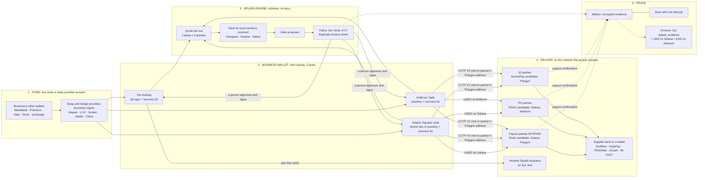
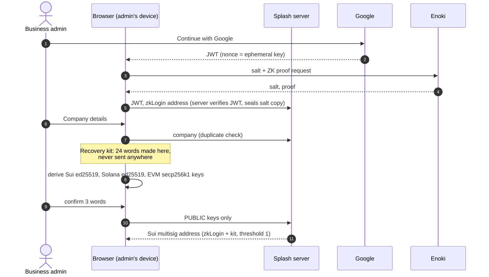
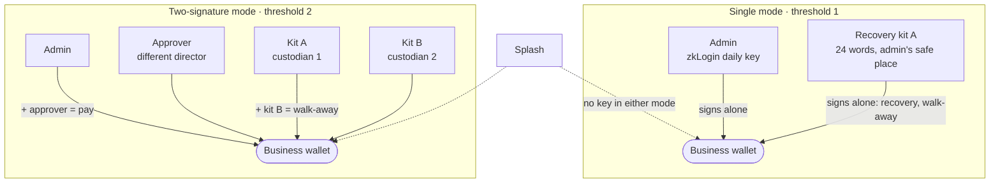
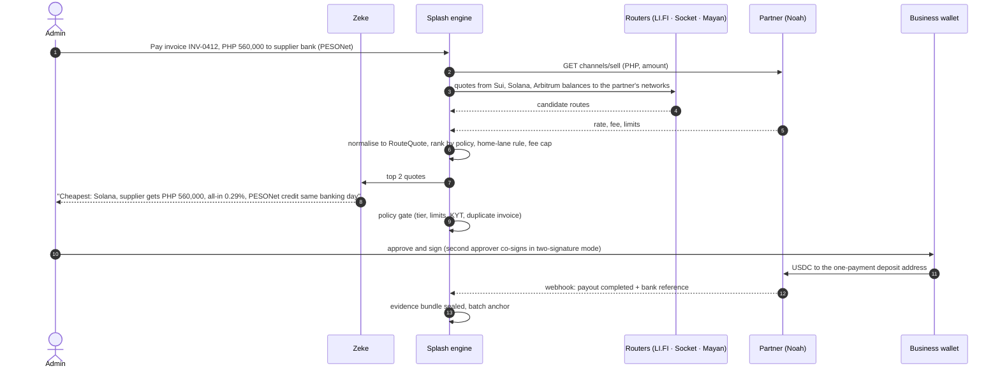
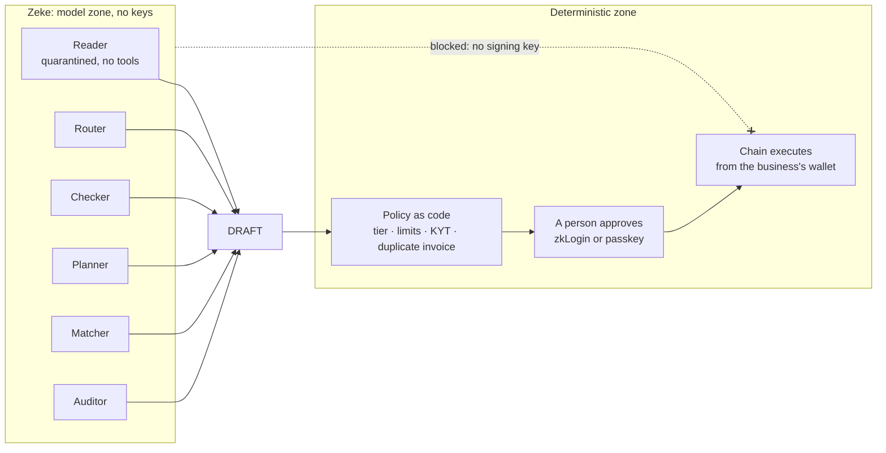

# Splash Business Module v15

**Status: COMPLETE DRAFT, UNCONFIRMED.** v14 (22 Sep 2026) stays canon until Sky says "update v14 → v15". Every Move change needs Sebastian's written sign-off.
**Date:** 4 Oct 2026 (rev. 04:40 MYT: three settlement lanes; supported assets = what partners and swap providers accept) · **Supersedes:** v15 DRAFT of 28 Sep, Full Picture v15 draft of 3 Oct (§12–§14 folded in) · **Repo checked:** `sky9484/phase1` main @ `3f78f5a` plus branches `feat/v15-wallet` (a5ab2e5), `feat/v15-splash-evidence` (7c8b363), `feat/v15-approval-dead-end` (1367e07)
**Lenses applied:** engineering architecture (ADRs, §9), business moat (§8), AI-fintech founder (§0, §11), five-agent panel (§12).

---

## 0. Stress test of the model you described

Your model, as you stated it on 4 Oct: self-custodial, Splash holds no funds; two KYC tiers (Basic: stablecoin to stablecoin; Advanced: stablecoin to local fiat); zkLogin; fund with USDC or USDsui from any wallet through Mayan, Socket and LI.FI; balances held as native multichain USDC or USDT; a chain-agnostic engine where Sui, Solana and Arbitrum are the settlement lanes and compete for the best quote (updated 04:38: "main settlement engine will be Sui, Solana & Arbitrum"), supported coins and networks are "whatever our partner and swap provider accepts", Zeke proposes Cheap / Fast / Secured, Sui is always first choice (Solana first for Colosseum), and the maximum fee is 0.33%.

**What holds**
- **Self-custody is the right core.** It is the one design that makes "we hold no funds" true by construction. It also takes K10 (money transmission) from "probably" to "arguable no", because Splash never touches value.
- **Two tiers by what leaves the wallet is right.** Stablecoin-to-stablecoin needs your own screening. Stablecoin-to-bank needs the licensed partner's KYB. That maps exactly onto who carries the regulatory risk.
- **A competing-lanes engine is right.** No single chain wins every corridor. Noah takes Solana and Polygon but not Sui or Arbitrum. PDAX takes Solana and Arbitrum. DurianPay's deck lists Polygon.
- **"Supported = whatever partners and swap providers accept" is right, with one guardrail.** Funding can start from any asset a swap provider accepts, converted to USDC or USDT in the business's own wallet. Balances stay USD stablecoins on the three lanes (I7). Delivery goes to whatever token and network the partner accepts. One registry drives all three, so the docs page and the app can never disagree.
- **Three lanes, not four, is the better call.** Polygon (and Base) become **delivery networks**: CCTP V2 mints USDC straight to the partner's deposit address on Polygon from a Solana or Arbitrum balance. Splash needs no wallet or contract there.

**What breaks, and the fix**

| # | What you said | Where it breaks | Fix in v15 |
|---|---|---|---|
| 1 | "We hold no fund" | The current wallet branch gives **Splash's cold key weight 1**. Recovery contact plus Splash can sign **any** transaction; the 72-hour notice is server-side only. That is co-signing, not self-custody | **Delete the Splash key.** Replace it with a **recovery kit**: 24 words generated on the business's device (Noah's pattern, from your screenshot). Splash never sees it (§4.4, ADR-15-01) |
| 2 | "Sui will always be first choice" | Every bank payout has to leave Sui: no licensed partner takes USDC on Sui, and Sui is **CCTP V1-only** (limits fall 31 Oct, contracts pause 1 Dec; Circle still lists Sui as V1-only on 4 Oct) | Sui is the **home lane**: accounts, approvals, free Splash-to-Splash transfers, evidence. For payouts it wins only on a near-tie (within US$1 or 0.02%). Rule in §4.5 |
| 3 | "For Colosseum, Solana and Arbitrum first" | Colosseum judges Solana work only. Arbitrum in the Colosseum build earns nothing and costs time | Colosseum build: `ENGINE_HOME_CHAIN=solana`, lane `solana`, with delivery to any network the partner accepts. The Arbitrum build is its own home (`arbitrum`) |
| 4 | "Socket for funding" | Socket/Bungee has **no Sui USDC route in either direction** (live check, 28 Sep) | Socket only for EVM↔EVM and EVM↔Solana. Into Sui: Mayan first, LI.FI as fallback |
| 5 | "Native multichain USDC **or USDT**" | USDT on Sui is a **bridged** token (Sui Bridge from Ethereum), not Tether-issued, and not on the gasless allowlist | Hold USDT only where the payout partner accepts it (I7 as reworded). On Sui, USDT is swap-in only |
| 6 | "Fund with USDsui" | No payout partner accepts USDsui; it traded as low as US$0.9901 (13 Jun 2026) | USDsui is funding only: shown with a one-tap swap to USDC before any payout |
| 7 | "Max fee 0.33%" | You don't have Noah's rate card. If partner cost runs above about 0.20%, a hard cap makes Splash pay the difference. The US$2 minimum alone is above 0.33% below about US$600; with ~0.20% partner cost, the target can't hold below about US$1,700 | **All-in target** ≤ 0.33% on tickets from US$2,000. Splash cuts its own fee first; anything still above target needs the client's explicit OK (§5) |
| 8 | "Basic KYC sends stablecoin to stablecoin" | Fine for wallets. But tier limits are **app limits, not locks**: in self-custody a business can always move its own money with the recovery kit in any wallet | Say exactly that in the terms. Splash's tiers limit what **Splash builds and signs off on**, never the money |
| 9 | "Zeke proposes" | Correct, but WhatsApp APPROVE still counts as a vote and `AUTO_EXECUTE` still exists in code (audit at 3f78f5a) | Remove both before any money demo (§4.8) |
| 10 | (missing) | Noah is a supplier **and a competitor**. You signed up to Noah directly; any Malaysian business can do the same and off-ramp without Splash | Splash's value has to sit above any one partner: multi-partner routing, approvals and dual control, invoice workflow, evidence, Zeke. A thin UI over Noah dies (§8) |

**One-line model (v15):** *Splash is self-custodial settlement software. Businesses hold their own stablecoin wallet on Sui, Solana and Arbitrum; Splash's engine races those three lanes for the best route to a payout partner, on whatever network that partner accepts; Zeke proposes, a person approves; every payment leaves an encrypted, anchored evidence record.*

---

## 1. What v15 changes against v14

| # | v14 / earlier v15 drafts | v15 (this document) | Supersedes |
|---|---|---|---|
| 1 | Principal model via Splash Labuan; "the licence is the moat" | **Self-custodial software.** Splash never receives, holds or pays client value. The Labuan principal path is parked until a Save/custody loop is ever pursued | overview "principal" thesis; K11 |
| 2 | Business multisig with a Splash cold recovery key (weight 1) | **No Splash key anywhere.** Members are only the business's own: admin zkLogin, optional passkey, optional second approver, **recovery kit** (device-generated 24 words) | 28 Sep §4; 3 Oct §13 table |
| 3 | Three tiers (Signed in, Basic, Advanced via Sumsub) | **Signed in** (no KYC, receive only) + **two KYC tiers**: Basic = stablecoin to stablecoin; Advanced = stablecoin to local bank, completed through the partner's own KYB | 28 Sep §5 |
| 4 | Sui is the settlement chain; bridge out for payouts | **Chain-agnostic engine**: Sui, Solana and Arbitrum are the settlement lanes and compete; Sui is home. Polygon, Base and others are delivery networks only | v14 |
| 4b | Fixed token list | **Supported cryptocurrencies and networks = the registry**: what swap providers accept for funding (converted at entry), USD stablecoins on the three lanes for balances, and what each payout partner accepts for delivery | new |
| 5 | I7: USD-only, USDC | **I7 reworded (approved 4 Oct):** "USD-pegged stablecoins accepted by the corridor's licensed partner". USDC default; USDT where accepted; depeg risk disclosed and carried by the client | I7 |
| 6 | Fee 0.70% to local currency (repo `lockedCopy.fee`) | **Free in-network; payouts all-in target ≤ 0.33% from US$2,000** | repo pricing of 26 Sep |
| 7 | Socket for inbound | Socket for EVM and Solana only; Mayan for Sui | D7 |
| 8 | Zeke = one copilot | **Zeke = six narrow agents** under one authority boundary | v15 §9 |
| 9 | Landing: "nets, yields, discounts, escrows" | Landing rewritten to the v15 truth (Sebastian master prompt §4) | repo copy |

---

## 2. The cast: who is involved

Status key: **Signed** = contract in place · **Self-serve** = public signup or SDK, no contract needed · **Candidate** = not signed, never named externally.

| Actor | Role in Splash | Touches money? | Holds a key to client money? | Contract with | Status |
|---|---|---|---|---|---|
| Business admin | Owns the wallet, approves payments | Yes, their own | **Yes** (zkLogin, passkey, recovery kit) | Splash (software terms) | — |
| Second approver | Co-signs in two-signature mode | Their company's | Yes, in that mode | Splash | — |
| Splash app (SPLASH MY SDN BHD, software) | Onboarding, quotes, building transactions, evidence, UI | **Never** | **No.** Its operational keys pay fees only: the Sui anchor/storage key (SUI, WAL), the Kora fee payer (SOL), the Pimlico paymaster deposit (ETH on Arbitrum), and the SAS/EAS attester keys. None can move client funds | Business; partners as tech platform | [CONFIRM SSM incorporation] |
| Zeke (Claude via Anthropic API) | Reads, drafts, explains, reconciles | Never | No | Anthropic (zero data retention, DPA) | Self-serve |
| Google (OAuth) | Identity for zkLogin | No | No | — | Self-serve |
| Enoki (Mysten) | zkLogin salt and prover; Sui gas sponsorship | No | No (a leaked salt "does not enable fund theft", per Sui docs) | Splash | Self-serve (Pro US$120/mo) |
| Shinami | Fallback prover, same salt | No | No | Splash | Self-serve |
| Sumsub | KYC of directors and UBOs; KYB documents | No | No | Splash | Candidate (keys pending) |
| KYT vendor | Wallet and transaction screening, pay-per-check; Elliptic later | No | No | Splash | Candidate |
| Mayan, LI.FI, Socket, Jupiter, Cetus/7K | Routing, bridging and swapping, always signed by the business | Passes through their contracts in the business's own transaction | No | None (SDK/API) | Self-serve |
| Circle | Issues USDC; CCTP burn-and-mint | Issuer | No | — | — |
| Sui, Solana, Arbitrum (lanes); Polygon, Base (delivery networks) | Execution and settlement | Ledger | No | — | — |
| Kora (Solana), Pimlico/Alchemy (Arbitrum) | Pay network fees for the business | Fee only | No | Splash | Self-serve |
| **Noah** | Off-ramp USDC → MYR/PHP/IDR to the beneficiary's bank. **Customer of record** for the paying business (Standard model) | Yes, at the fiat edge | Its own deposit addresses | **Business ↔ Noah** (business accepts Noah's terms); Splash ↔ Noah as technology platform | Candidate (sandbox self-serve) |
| PDAX | PH payout: PHP to bank, InstaPay/PESONet, GCash | Yes, fiat edge | Its own | Business or recipient ↔ PDAX | Candidate (in conversation) |
| GCash (GCrypto) | PH e-wallet delivery, reached through a partner | Fiat edge | — | — | Candidate |
| DurianPay | ID payout: IDR to bank (Disbursement product) | Yes, fiat edge | Its own | Recipient or platform ↔ DurianPay | Candidate (pilot planned) |
| Airwallex (Malaysia) Sdn Bhd | Optional licensed MYR/PH/ID payout rail behind the off-ramp (BNM Class A + e-money, verified 4 Oct) | Fiat | — | Business ↔ Airwallex (Connected Accounts) | Candidate |
| Beneficiary bank or e-wallet | Final credit: DuitNow/IBG (MY), InstaPay/PESONet/GCash (PH), BI-FAST (ID) | Fiat | — | Partner | — |
| Walrus | Stores encrypted evidence | No | No | Splash runs its own publisher | Self-serve |
| Seal key servers (5-of-8 committee) | Release decryption keys only to allowlisted addresses | No | No | Splash | Self-serve; pricing open |
| Auditor or tax agent | Reads evidence through a time-boxed Seal grant | No | No | Business | — |
| Malaysian counsel (Ethos or other) | K10, K13 and the BNM question | No | No | Splash | **Engage (approved 4 Oct)** |

**The rule the table proves:** the only parties that ever hold client value are the business itself and, at the fiat edge, a licensed partner that has its own contract with the business. Splash sits in neither position.

---

## 3. The whole system in one picture



**Reading it:** money only ever moves along solid lines that start in the business's wallet and carry the business's signature. Dotted lines are data. Splash's engine sits in the middle with no key. Polygon appears only as a **destination**: CCTP V2 mints USDC directly to the partner's deposit address there, so Splash keeps no wallet or contract on Polygon.

---

## 4. Step by step: who does what

### 4.1 Onboard (sign in → company → wallet → recovery kit)

| Step | What happens | Who does it | What Splash stores |
|---|---|---|---|
| 1 Sign in | "Continue with Google" → zkLogin | Business admin, Google, Enoki (salt + proof) | User id, zkLogin address, sealed copy of the salt |
| 2 Company | Name, registration number, country. Duplicate check on (country, number) with a neutral message | Admin | Company row |
| 3 **Recovery kit** | 24 words generated **in the browser** (BIP-39, WebCrypto entropy) by open-source code with a published hash, or **bring your own** (made in any BIP-39 tool; the business pastes only the public keys). Screen modelled on Noah's: *"These words are made on your device. Splash never sees them."* Show / Copy / Download, then the admin confirms 3 random words. Derives one key per chain family | Admin's device only | **Public keys and proof-of-possession signatures only** (Sui, Solana, EVM). Never the words, never a private key |
| 4 Wallet | Sui multisig created from zkLogin + recovery-kit key (single mode). The Solana vault and the Arbitrum Safe are created **lazily**, on the first funding or payout that needs them. The business downloads a **wallet descriptor**: a public, non-secret file listing every member public key (including the zkLogin public identifier), weights and threshold per chain | Splash builds; the admin's signatures create it | Addresses, member public keys, threshold, version; the same descriptor |
| 5 State | **Signed in**: receive only in the app | — | — |



**Derivation paths (standard, so any wallet can import the kit):** Sui `m/44'/784'/0'/0'/0'` · Solana `m/44'/501'/0'/0'` · EVM `m/44'/60'/0'/0/0`.

**Walk-away test (must pass before launch, in both signing modes):** with Splash's servers switched off, the business moves every balance using only its recovery kit(s), the wallet descriptor and public tools. A wallet that imports the kit (Slush) controls only the kit's own address, not the multisig, so this is not "import into Slush":
- **Sui:** Splash's open-source recovery page (a static file published in the repo's releases) or `sui keytool multi-sig-combine-partial-sig` builds the multisig signature from the kit's signature and the descriptor.
- **Solana:** the Squads app with the kit's key as a member.
- **Arbitrum:** the Safe app with the kit's EOA as an owner.

If the test fails anywhere, "self-custody" can't be claimed on that chain. The zkLogin members depend on Splash's Google OAuth client, the salt and a prover, so **they don't count toward the walk-away test**. That is why two-signature mode needs two custodian kits (§4.4).

### 4.2 KYC tiers

| | Signed in | **Basic** | **Advanced** |
|---|---|---|---|
| What it unlocks in the app | Receive USDC/USDT on invoices; sandbox | **Stablecoin → stablecoin**: pay Splash businesses (free on Sui) and outside wallets (ownership proven, screened) | **Stablecoin → local bank or e-wallet** (MYR, PHP, IDR) through a licensed partner |
| Who verifies | — | **Splash** (admin review) | **The licensed partner's own KYB** (Noah, PDAX, DurianPay), pre-filled by Splash |
| Business provides | Google account | Company name, registration number, country; applicant name and role; company-domain email; registry document (SSM profile / NIB / SEC); declaration of authority and purpose | Everything partners need, collected once (the core profile): entity documents, tax ID, directors, UBOs ≥ 25% with source of funds, registered address, company bank account, PIC contacts |
| Screening | — | Sanctions (company + applicant); KYT on the wallet; KYT on every outside recipient wallet | Same + the partner's own monitoring |
| Limits (proposal) | — | US$5,000/day, US$25,000 per rolling 30 days | US$100,000/day, US$1M per 30 days (Move cap 1,000,000 per transfer); partner and rail limits also apply (e.g. DuitNow RM1M, InstaPay ₱50k) |
| Plan | Free | Free | Business US$149/mo (founding US$99) or Pro US$499/mo |

**How Advanced works with Noah (docs read 4 Oct):**
- Noah's **Standard model**: Noah is the customer of record and runs KYC/AML. The business accepts Noah's terms in a hosted session. Reliance is only for regulated integrators, and only for EUR.
- Splash calls `POST /onboarding/:CustomerID/prefill` with `type: BusinessCustomerPrefill` (company, UBOs, representatives, corporate shareholders). Then `POST /onboarding/:CustomerID` opens the hosted session for gaps and T&Cs. The hosted page emits a `kycCompleted` postMessage when the session closes; the **source of truth is Noah's Customer webhook**. Noah reviews businesses by hand.
- **Sumsub share tokens work only for individuals** (directors and UBOs). "Noah does not support Sumsub token share for the company applicant." So Splash pre-fills the company and shares individual tokens for the associates.

**Partner-share ledger:** every field sent to a partner is logged (org, partner, fields, consent version, time, by whom). Consent is per partner and per corridor, under PDPA (MY), the PDP law (ID) and the DPA (PH). KYB files live in Postgres and object storage, **never on Walrus**.

### 4.3 Fund the wallet

**Supported cryptocurrencies and networks = the registry** (`lib/partners/registry.ts` plus the route providers' live token lists). Three layers, one source of truth:

| Layer | What is accepted | Who decides |
|---|---|---|
| Fund in | Any asset and network a swap or bridge provider can convert to USDC or USDT **in the business's own wallet** (for example ETH, SOL, SUI, USDsui, USDC on Ethereum/Base/Polygon) | The provider's live token list, filtered by Splash's screening and a deny-list |
| Hold | USDC (default) and USDT, on Sui, Solana and Arbitrum only | I7 as reworded: USD stablecoins a corridor partner accepts |
| Deliver | Whatever token and network the payout partner accepts (Noah: Solana, Polygon, Base, Ethereum; PDAX: Solana, Arbitrum; DurianPay: Polygon) | The partner, in writing |

The public docs page "Supported cryptocurrencies & networks" is generated from this registry, so it is never out of date.

| Source | Lands in | Route (the business signs) | Splash fee | Note |
|---|---|---|---|---|
| USDC already on Sui (Slush, exchange withdrawal) | Sui | Deposit QR | 0 | Can be gas-free; lands in an address balance |
| USDsui, SUI or other Sui assets | Sui | Deposit, then swap to USDC (Cetus/7K/Aftermath, partner fee 0) | 0 | USDsui is never paid out as USDsui |
| USDC, USDT or SOL on Solana | Solana (direct, swap via Jupiter if needed) or Sui (Mayan) | Direct / Jupiter / Mayan Swift or MCTP | 0 | Route cost at cost |
| USDC/USDT on Arbitrum | Arbitrum (direct) | Direct | 0 | — |
| USDC on Ethereum, Base or Polygon; ETH | Arbitrum or Solana (CCTP V2 via LI.FI or Socket); Sui via Mayan only | LI.FI / Socket / Mayan | 0 | LI.FI adds 0.25% when it does a swap: show it |
| MYR from the business's own bank | Its own wallet, via an SC-registered exchange (HATA, Luno, MX Global, SINEGY, Kinetic) | Withdraw native USDC to its own address | 0 | First-party only; no affiliate fee until counsel clears it |

**Controls on every funding route:**
- The destination is locked to the business's own address. Mayan's SDK accepts any destination, so the lock is Splash's job.
- The destination token must be native USDC or USDT on the allowlist. Wrapped routes are excluded.
- Both addresses are screened before the transaction is built.
- EVM approvals are for the exact amount only. The LI.FI (2024) and Socket (2024) exploits drained users who had granted unlimited approvals.
- Swapping a volatile asset (ETH, SOL, SUI) into a stablecoin is the business's own trade in its own wallet. Show the price impact and the quote expiry. In-app swaps are counsel question K13.

**What the business sees:** one USD balance, broken down by lane and token underneath. The money physically stays where it landed. The engine moves it just in time, at payment.

### 4.4 The wallet: self-custody keys on every lane

**Members (no Splash key, ever):**

| Key | Who holds it | Sui | Solana | Arbitrum |
|---|---|---|---|---|
| Admin daily key | Admin | zkLogin (Google) | Passkey through a secp256r1 smart-wallet signer [VERIFY: Swig or LazorKit] as a Squads V4 member; fallback a non-extractable WebCrypto Ed25519 device key | Passkey owner on Safe (RIP-7212 on Arbitrum) |
| Approver (two-signature mode) | A **different director or officer**, matched against the KYB associates list | zkLogin | Passkey or device key | Passkey |
| **Recovery kit A** | Admin in single mode. In two-signature mode, a **custodian** who does not approve payments; generated fresh on the custodian's own device when the mode is switched on | ed25519 from the 24 words | ed25519 from the 24 words | secp256k1 from the 24 words |
| **Recovery kit B** (two-signature mode) | A second custodian, also not an approver | same | same | same |

**Signing modes (Sky's 4 Oct decision, rebuilt without a Splash key and with the dual-control hole closed):**

| Mode | Threshold | Members (weight 1 each) | Who can pay | Walk-away without Splash |
|---|---|---|---|---|
| **Single** (default) | 1 | Admin · Kit A | The admin | Kit A alone |
| **Two-signature** (company switches it on) | 2 | Admin · Approver · Kit A (custodian 1) · Kit B (custodian 2) | Admin + approver | Kit A + Kit B |



**Why this shape:**
- **The hole in the first draft.** With one kit at threshold 2, the admin who made and downloaded the kit could sign with admin + kit and skip the approver. So switching on two-signature mode **retires the old kit** (the migration creates a new address) and makes new kits on custodians' devices.
- **What two-signature mode needs, and why.** No single key reaches the threshold. Every pair is two different people, provided nobody holds two keys. Splash enforces separate devices, separate Google accounts and different KYB associates. It cannot stop collusion or a copied kit.
- **Walk-away.** zkLogin keys stop working if Splash's Google OAuth client disappears, so the walk-away path needs two non-zkLogin keys: Kit A + Kit B.
- **Settings line (exact):** "Any two keys can sign. Keep both recovery kits with people who don't approve payments, in separate places."
- **Switching modes is a migration.** Members and threshold set the address, so a switch means a new address plus a sweep the current wallet signs. Turning two-signature mode **off** needs two signatures, normally admin + approver. The two custodians together could also do it, which is why custodians are a trusted role.
- **The evidence allowlist is updated in the same flow** (§4.7).

**Recovery scenarios:**

| Lost | Sui | Solana | Arbitrum |
|---|---|---|---|
| Phone | Sign in with Google again: same zkLogin address (salt held by Enoki, sealed copy at Splash) | The device key is gone (and Safari can evict IndexedDB after 7 days unused). Kit A signs a Squads config change adding a new device key. Synced passkeys avoid this | Synced passkey (iCloud / Google Password Manager) survives; otherwise Kit A adds a new owner |
| Google account | Kit A (single) or the custodians (two-signature) sign a migration to a new admin key | n/a | n/a |
| Splash or Enoki gone | The walk-away test path (§4.1) | Squads app + kit | Safe app + kit |
| All kits **and** the admin key, single mode | **Funds are lost.** Say so at the kit screen; push two-signature mode | same | same |

**Setup checks that prove Splash has no back door (tests, every build):**
- Sui: the multisig's members are exactly the descriptor's.
- Solana: the Squads `configAuthority` is null (autonomous multisig).
- Arbitrum: the Safe has no module other than Safe4337Module, and no guard.
- Honest caveat for the docs: the kit is generated by JavaScript Splash serves. Mitigations: the code is open source with a published hash, and "bring your own kit" is offered.

**What this does to the code on `feat/v15-wallet`:**
- Delete the `splash-cold` role, `ORG_WALLET_THRESHOLD = 2` with its weights, and the Splash-assisted recovery flow (`org-wallet-recovery.ts`, `org-wallet-sweep.ts`).
- Add `recovery-kit` and `approver` roles, thresholds 1 and 2, and the descriptor export.
- Keep the salt vault, Enoki-first resolution, migration-as-new-row, and the partial unique index.

### 4.5 Send: the route engine

**Inputs:** the payment (amount, currency the recipient must receive, recipient type: Splash business / outside wallet / bank), the sender's balances by chain and token, and the recipient's partner and accepted tokens.

**Algorithm:**
1. **Eligible payout targets.** From the partner registry, list the (network, token) pairs the recipient's corridor partner accepts. Noah: Solana, Polygon (Base and Ethereum also listed; no Sui, no Arbitrum). PDAX: Solana, Arbitrum. DurianPay: Polygon (from its deck; confirm in writing). For a Splash business: Sui direct. A target network need not be a lane: Polygon is reached by minting there directly.
2. **Candidate routes.** Sources are only the three lanes (Sui, Solana, Arbitrum) where the business holds balances. For each target: no move needed if the balance is already on the target network; otherwise source → target via:
   - CCTP V2 from Solana or Arbitrum, with `mintRecipient` set to the partner's deposit address on Polygon, Base, Solana or Arbitrum
   - Mayan Swift (solver; **test Sui as source**)
   - Mayan MCTP (from Sui, **CCTP V1, dead from 1 Dec** unless Circle ships V2 on Sui first, which Circle's migration page says it will)
   - LI.FI, or Socket (EVM/Solana only)
   - plus a swap leg if USDT → USDC is needed
3. **Quote fan-out in parallel:** LI.FI `/advanced/routes`, Socket `/v3/swap/quote`, Mayan `fetchQuote`, and the partner quote (Noah `channels/sell` with rate and fee). Timeout 2.5 s; drop the slow ones.
4. **Normalise** every candidate to a `RouteQuote`: **net local amount received**, all-in cost (route + partner + Splash), ETA, expiry, risk flags.
5. **Rank by policy:**
   - **Cheapest:** maximum net local received.
   - **Fastest:** minimum ETA among quotes within 0.10% of the best net.
   - **Safest:** native burn-and-mint (CCTP V2) or same-chain only. No solver or liquidity-pool bridges, the partner with the best confirmation record, and extra confirmations.
6. **Home-lane preference.** If a route sourced from `ENGINE_HOME_CHAIN` is within max(US$1, 0.02%) of the winner, the home lane wins, and **the quote shows the difference** ("Sui route chosen: +US$0.84 vs cheapest. Switch"). This is the precise meaning of "Sui first". It never applies when the business has picked Cheapest and tapped "strictly cheapest".
7. **Fee cap check (§5)**, then Zeke explains the top pick and one alternative in plain words.
8. **Policy gate** (deterministic): tier and limits, KYT on the recipient address, the invoice-hash duplicate check, quote expiry.
9. **The person approves** (zkLogin, or passkey step-up above the threshold); in two-signature mode the approver co-signs.
10. **Execute.** The business's wallet signs. Splash relays only.
11. **Record the quoted route against the executed one** in the evidence bundle.

**`RouteQuote` (shared type, all builds):**
```ts
type RouteQuote = {
  id: string; policy: 'cheapest' | 'fastest' | 'safest';
  source: { lane: 'sui'|'solana'|'arbitrum'; token: 'USDC'|'USDT'; amount: string };   // balances live only on the three lanes
  target: { network: string; token: string; partner: string; depositAddress?: string };   // whatever the partner accepts (registry)
  steps: Array<{ kind: 'swap'|'bridge'|'transfer'|'partner'; provider: string; fee: string; etaSec: number }>;
  costs: { route: string; partner: string; splash: string; allInBps: number };
  fx?: { pair: string; rate: string; reference: string; capturedAt: string };
  netLocal: { currency: 'MYR'|'PHP'|'IDR'|'USD'; amount: string };
  etaSec: number; expiresAt: string;
  flags: Array<'above_target'|'cctp_v1'|'solver_bridge'|'usdt'|'home_lane'>;
};
```

**Which lane is live in which build:**

| Build | `ENGINE_HOME_CHAIN` | `ENGINE_LANES` | Why |
|---|---|---|---|
| Sui main (Basecamp) | `sui` | `sui,solana,arbitrum` | Sui home; bank payouts leave from Solana or Arbitrum balances (or from Sui via Mayan while CCTP V1 lasts) |
| Solana (Colosseum, deadline 12 Oct) | `solana` | `solana` | Only Solana work counts; delivery to Polygon by CCTP V2 mint is still allowed |
| Arbitrum | `arbitrum` | `arbitrum` | PDAX direct; Noah and DurianPay by CCTP V2 mint to Polygon |

**Delivery networks are not lanes.** They come from the partner registry: Polygon, Base, Ethereum today. Splash keeps no wallet and no contract on them.



### 4.6 Deliver: payout through the partner of record

| Corridor | Partner (candidate) | Networks it accepts (registry) | Rail to the supplier | Who is the partner's customer | Splash's role |
|---|---|---|---|---|---|
| MY → MY (supplier's MYR account) | Noah | Solana, Polygon (Base, Ethereum) | DuitNow / IBG [CONFIRM which entity pays MYR] | The paying business (Standard model) | Pre-fills KYB, builds the transaction, records evidence |
| MY → PH | Noah or PDAX; GCash through PDAX | Noah: Solana, Polygon · PDAX: Solana, Arbitrum | InstaPay ₱50k, PESONet ₱10M, GCash | Noah: the payer · PDAX: [CONFIRM: payer or recipient] | Same |
| MY → ID | DurianPay; Noah as alternate | Polygon (DurianPay deck) | BI-FAST / Disbursement (SNAP) | Pilot: the Indonesian supplier is DurianPay's own merchant | Orchestration only |
| Any → Splash business | — | Sui | On-chain | — | Free (gas-free send) |

**Noah payout mechanics (sandbox `business.sandbox.noah.com`):**
1. `GET channels/sell?Country=MY` (or PH, ID) lists the payout channels.
2. Create the beneficiary and the payout. Noah returns a deposit address for that payment on Solana or Polygon.
3. The business's wallet sends exactly that USDC. Automated payout triggers on deposit, matched on `SourceAddress`.
4. A signed webhook carries the status and bank reference into evidence.

**Invariant:** a payout's on-chain destination is either the business's own address or the partner's one-payment deposit address. Never a Splash address.

**Optional licensed MYR rail.** Airwallex (Malaysia) Sdn Bhd is verified on BNM as Class A MSB plus e-money issuer, and supports Malaysian Connected Accounts with KYB by API. It does **not** take USDC in. Use it only behind an off-ramp ("Noah sells USDC → Airwallex pays"), and only if counsel says a BNM licensee is needed on the ringgit leg. **Avoid Wise as a partner:** its rules bar businesses that exchange or trade crypto.

### 4.7 Prove: the evidence record

**Bundle contents (kind 3, corridor payout):**
- invoice hash and e-invoice reference (MyInvois UUID or BIR)
- the approval chain (who, when, which key)
- KYC tier at the moment of payment
- the KYT result id
- route quoted against route executed
- every chain transaction hash
- partner order id, FX rate and reference, partner payout id, bank reference
- the receipt

**Where it lives:**
- **Walrus** (Splash's own publisher, `permanent=true`, 53 epochs, a renewal job, quilts by customer and retention class).
- **Seal** allowlist (`splash_evidence::allowlist`). Members are each authorised person's **reader address**, never a multisig. A Seal session key needs one signature, and multisig sessions would need two people to read a receipt:
  - On Sui, the reader address is the person's zkLogin address.
  - On the Solana and Arbitrum builds, it is a per-person non-extractable device key mapped to a Sui address.
  - Recovery kits are never used for reading.

  These addresses are pseudonymous, but the shared allowlist still links a payer's readers to a recipient's. Accept that link for now; per-bundle derived reader addresses are the later fix. Mode migrations and staff changes update the allowlist in the same flow. Auditors get time-boxed grants.
- **Anchors:**
  - Sui: `splash_evidence::anchor` per bundle for pilots, then a batched Merkle root through authenticated events past about 1k receipts a day.
  - Solana: the same root in a SAS attestation.
  - Arbitrum: the same root in an EAS attestation.

**Claim discipline:** "anchored" only when `anchor_status = ANCHORED` for the payment shown. Until then: "recorded, anchor pending".

### 4.8 Zeke: six agents, one authority boundary

| Agent | Job | Reads | Can produce | Can never |
|---|---|---|---|---|
| **Reader** | Extracts fields from invoices, PDFs and chat intents | The file only, in **quarantine** (no tools) | Validated JSON (zod); every field shown for confirmation | Act on instructions inside a document; mark a new bank detail as payable without out-of-band verification |
| **Router** | Explains engine quotes, recommends a policy | `RouteQuote[]` | A recommendation in plain words ("Cheapest saves RM 41, arrives in ~2 hours") | Change amounts, recipients or routes |
| **Checker** | Pre-checks a draft against tier, limits and screening | Deterministic results only | A "will pass / will fail because…" note | Override a policy result |
| **Planner** | Forecasts payables and funding needs | Invoices due, balances by chain | A funding or batching suggestion | Propose yield or anything custodial |
| **Matcher** | Reconciles partner confirmations to invoices | Webhooks, chain events | A mismatch flag | Close a mismatch on its own |
| **Auditor** | Assembles evidence packs and MyInvois/BIR exports | Evidence the user can already decrypt | A draft pack for the user to share | Grant anyone access |



- **Models:** `claude-sonnet-5-5` plans and runs the agents; `claude-haiku-4-5-20251001` is the second-pass verifier only (retiring no sooner than 15 Oct 2026, so pin a replacement); `claude-opus-5-5` grades the offline evals.
- **Authority boundary:** Zeke's only output is a **draft**. Policy runs as code; a person approves; the chain executes. Remove the WhatsApp APPROVE vote and the `AUTO_EXECUTE` outcome before any demo.
- **Eval gate:** a golden and adversarial set (poisoned PDF, a changed-bank-details email, prompt injection in a memo) must show zero unauthorised actions before any stage demo.
- **Next (PLANNED):** Sui scoped authority, where a policy the finance team sets ("these 5 suppliers, up to US$10k/month") is enforced by the chain. Zeke still only drafts inside it.

---

## 5. Fees and unit economics (proposal)

| Flow | Price | Notes |
|---|---|---|
| Splash ↔ Splash on Sui, invoice-backed | **Free** within tier limits | Gasless send; any fee leg must net ≥ US$0.01 to stay gasless |
| Splash ↔ Splash across chains | Route at cost, Splash 0 | — |
| To an outside wallet (Basic+) | 0.25% Basic / 0.10% Advanced / 0.07% Pro, min US$2 | D11 |
| **Bank or e-wallet payout (Advanced)** | Route at cost + partner at cost + **Splash 0.10% Cheapest / 0.15% Fastest / 0.15% Safest**, min US$2 | All-in **target ≤ 0.33% from US$2,000** |
| Exit to the business's own wallet on another chain | Route at cost + US$1 | — |
| Funding, swaps | Route at cost, Splash 0 | — |
| Plans | Free · Business US$149 (founding US$99) · Pro US$499 | Plans carry revenue while volume ramps |

**Cap rule:**
1. If a quote's all-in is above 0.33% on a ticket of US$2,000 or more, Splash lowers **its own** fee to a floor of 0.05%, **and the US$2 minimum is waived** (otherwise the minimum would block the cut below US$4,000).
2. If it is still above target, the quote shows `above_target` and needs an explicit tap to accept.
3. Splash never subsidises partner cost.
4. Below US$2,000 the minimum applies and the quote states the all-in percentage plainly.

**Worked example** (US$10,000 to a PHP bank account; partner cost assumed 0.20%):

| Policy | Route | Partner | Splash | All-in |
|---|---|---|---|---|
| Cheapest | 0.01% | 0.20% | 0.10% | **0.31%** |
| Fastest | 0.03% | 0.20% | 0.15% | 0.38% → Splash cut to 0.10% → 0.33% |

**Economics recap (defense book, 1 Oct):**
- Burn is about US$57k a month.
- Freight-weighted break-even is about **187 businesses / US$27M a month**.
- One Pro-size forwarder at US$400k a month brings about US$780 a month at the 0.07% outside-wallet rate plus the plan, or about US$900 at the 0.10% payout fee.
- **Plans, not edge fees, are the lever.** If Noah's real rate comes in above 0.20%, the 0.33% target fails on Fastest and Safest. Get the rate card before Basecamp.

---

## 6. Chains: role, stage, what to build

| Network | Role | Payout partners that accept it | Stage | Build |
|---|---|---|---|---|
| **Sui** | **Settlement lane, home:** accounts, approvals, free Splash ↔ Splash, evidence and anchors, Seal | None verified (Coins.ph lists the Sui network; USDC unconfirmed) | Live lane (USDC on mainnet per repo footer) | Main build |
| **Solana** | **Settlement lane:** primary payout source | Noah, PDAX (also Yellow Card, TransFi, Tazapay on record) | Colosseum by 12 Oct | Native build (prompt 2) |
| **Arbitrum** | **Settlement lane:** PDAX direct; Noah/DurianPay via CCTP V2 mint | PDAX (also TransFi, Tazapay) | After Colosseum | Native build (prompt 3) |
| Polygon | **Delivery network only:** CCTP V2 mints to the partner's deposit address; no Splash wallet or contract | Noah, DurianPay (deck) | With the Solana and Arbitrum lanes | Registry entry |
| Base, Ethereum | Delivery networks (Noah lists them) | Noah | When needed | Registry entry |
| Aptos | Route adapter only (CCTP V2 domain 9) | — | Later | — |

**Gate on 31 Oct:** keep Sui-sourced payouts only if Circle lists Sui on V2, Mayan or LI.FI route through it, and live exit tests pass at US$100, 1,000 and 10,000. Otherwise payouts fund from Solana or Arbitrum balances and Sui keeps the record. (Circle's migration page says Sui gets V2 before deprecation begins; plan for it, don't depend on it.)

---

## 7. Compliance posture and the public docs page

**What Splash is:** software. It doesn't receive, hold, convert or pay client value. Licensed partners hold funds at the fiat edge, under their own contracts with the business.

**What Splash still owes the market:**
- screening (KYT on every outside wallet and payout)
- sanctions checks
- PDPA consent and the share ledger
- honest risk disclosures (depeg including USDT, chain halts, bridge risk, the CCTP V1 deadline, self-custody loss)
- "Splash is not yet a licensed money-services business" on the Trust and Compliance page

**Counsel questions (engage now):**
- **K10:** Is Splash in scope of the MSBA when it never holds value but pre-fills partner KYB and builds payout transactions?
- **K13:** In-app routing and swaps under the SC's digital-asset rules.
- **K14:** Does "Noah sells USDC → a BNM licensee pays" need to be the shape for MYR?
- **PH:** Does the SEC's CASP "wallet provider" category reach non-custodial software?
- **ID:** Does the ban on foreign provision apply when the recipient is the partner's own customer?

**Docs site** (Sebastian master prompt §5), modelled on docs.noah.com's structure:

| Section | Pages |
|---|---|
| Getting started | Overview · How Splash works · Compliance overview · Security overview |
| Accounts | Your wallet and self-custody · The recovery kit · Two-signature mode · Lost access |
| Verification | KYC tiers · What we collect and why · Sharing with payout partners · Retention and deletion |
| Payments | Funding · **Supported cryptocurrencies & networks** (generated from the registry) · The route engine (Cheapest / Fastest / Safest, home lane) · Fees · Limits · Corridors |
| Evidence | What is recorded · Verify an anchor · Auditor access |
| Zeke | What Zeke can and cannot do · Models and data use |
| Risk disclosures | Stablecoins and depeg · Networks and halts · Bridges · Self-custody |
| Legal | Terms · Privacy · Not a licensed MSB · Complaints |
| Status | Network status · Changelog |

---

## 8. Moat (business-moat lens)

**Competitors:**

| Capability | Bank TT | Wise Business | Airwallex | Request Finance | Noah direct | DurianPay | **Splash v15** |
|---|---|---|---|---|---|---|---|
| Self-custody | — | — | — | Yes (non-custodial) | MPC custody | — | **Yes** |
| Fund in stablecoins from any chain | — | — | Out only (USDC payouts, early access) | Yes | Yes (its chains) | Crypto deposit (no Sui) | **Yes, routed** |
| Routes ranked by local currency received across lanes and partners | — | — | — | — | Single partner | Single | **Yes** |
| MY / PH / ID payouts | Yes, slow, 3.92%–9.56% | Yes | Yes | Limited | Yes | ID | Through partners |
| Maker-checker approvals | Portal | Basic | Yes | Yes | Basic | — | **Yes, on-chain in two-signature mode** |
| Audit evidence pack (MyInvois/BIR) | — | — | — | Partial | — | — | **Yes** |
| AI agent on payables | — | — | Some | Some | — | — | **Yes, propose-only** |

**Advantage chain:**
- **Wedge:** Malaysian forwarders and importers paying Philippine and Indonesian agents and suppliers, before BIR's 31 Dec deadline.
- **Value:** under the 3.92% corridor average with same-day payouts, plus proof.
- **Distribution:** forwarder associations (FMFF), accounting software (QNE reaches about 75k SMEs), the Sui ecosystem.
- **Retention:** the approval workflow every payment run, the evidence history, the recipient directory.
- **Compounding:** recipients who receive on Splash pay onward for free (corridor density); a dataset of quoted against executed routes per corridor; an evidence format auditors already accept.
- **Capture:** plans and edge fees.

**Scorecard (0–5, now → 24 months):**

| Moat | Now | Target | Why |
|---|---|---|---|
| Network effects (recipients on Splash) | 0 | 4 | Free onward payments on Sui |
| Switching cost (workflow + evidence) | 1 | 4 | Approvals and years of records |
| Data (route performance, executed vs quoted) | 0 | 3 | Only a multi-partner router has it |
| Distribution | 1 | 3 | Associations, accounting integrations |
| Regulation | 0 | 1 | Partners hold the licences; it isn't Splash's moat |
| Trust and brand | 1 | 3 | The walk-away test passed publicly; named auditor acceptance |

**Evidence gaps that kill the story if left open:**
- 0 LOIs (K4)
- no partner rate card
- no auditor has said yes to the evidence pack
- the share of volume staying on Sui hasn't been measured

**Fastest ways to copy Splash:**
- Noah adds approvals and multi-chain funding (6 months).
- DurianPay builds MY → ID (6–12 months).
- Airwallex accepts stablecoin funding in Malaysia (12 months).
- Request Finance adds MYR/PHP/IDR payouts (12 months).

**Counter-strategy:**
1. **Multi-partner from day one.** Never ship single-partner, or you are Noah's UI.
2. **Own the recipient side.** Onboard Philippine and Indonesian suppliers as Splash wallets so they receive for free and pay onward for free.
3. **Get one named audit firm to accept the evidence pack in writing.**
4. **Integrate with Malaysian SME accounting** (QNE, AutoCount, SQL Account).

**Roadmap:**

| Horizon | Moat work |
|---|---|
| 6 months | 1 signed partner per corridor; 3 LOIs → 10 paying businesses; evidence pack v1 reviewed by one audit firm; QNE integration pilot |
| 12 months | 2 partners per corridor (routing becomes real); 100 recipient wallets paying onward on Sui; route-performance dashboard published monthly |
| 24 months | Evidence format accepted by MyInvois/BIR advisers; Sui scoped-authority policies for recurring suppliers; corridor density metric reported to investors |

---

## 9. Architecture decisions (ADR format, all **Proposed**, deciders Sky + Sebastian)

**ADR-15-01 · Self-custody wallet with a device recovery kit**
- **Context:** the Splash cold key (weight 1) plus a recovery contact can sign any transaction, which contradicts "we hold no funds".
- **Options:**
  - A: keep the Splash key. Easy recovery, but co-signing and a K11 problem.
  - B: an MPC vendor (Privy/Turnkey). Trust in vendor enclaves, and it duplicates Move policy (canon rejected Privy).
  - C: zkLogin plus a recovery kit generated on the device. **Chosen.**
- **Consequences:**
  - Easier: an honest self-custody claim; K10 and K11 shrink; the walk-away test.
  - Harder: a business that loses both Google and the kit in single mode loses its funds, so the UX must push two-signature mode.

**ADR-15-02 · Three settlement lanes with a home lane; delivery networks from a registry**
- **Options:**
  - A: Sui only, bridging out for payouts. Single exit, which dies 1 Dec without CCTP V2.
  - B: hold balances on every partner chain (four or more lanes). More wallets and key stacks for little gain.
  - C: three lanes (Sui, Solana, Arbitrum) compete, with a disclosed home-lane preference inside US$1 / 0.02%. Polygon and Base are delivery networks reached by CCTP V2 mint. **Chosen** (Sky, 04:38).
- **Consequences:**
  - Harder: three key stacks to audit (Sui multisig, Squads, Safe).
  - Easier: no Polygon wallet or contract.
  - Revisit: on 31 Oct (CCTP).

**ADR-15-03 · The licensed partner is customer of record at the fiat edge**
- **Options:**
  - A: Splash as merchant or platform account. K10 risk, and it puts Splash in the money path.
  - B: reliance model. Needs a licence; impossible.
  - C: Standard model with Splash pre-filling KYB. **Chosen.**
- **Consequence:** businesses accept each partner's terms. The UX must make that one click per partner, shown up front.

**ADR-15-04 · One evidence store, anchors on every lane**
- **Decision:** Walrus + Seal as the only store; the same Merkle root anchored on Sui, SAS and EAS.
- **Consequence:** a Sui halt stops new writes and decryption, while the anchors on the other chains still prove the evidence existed.

**ADR-15-05 · Zeke as six propose-only agents, with a quarantined reader**
- **Options:** A: one generalist agent with tools. B: narrow agents with a quarantine and structured outputs. **Chosen: B.**
- **Consequence:** more evals, far smaller blast radius.

**ADR-15-06 · Pricing: free in-network, a policy-tiered edge fee, an all-in target**
- **Decision:** Splash absorbs its own fee first and never partner cost.
- **Revisit:** when Noah's rate card arrives. If counsel says percentage fees look like money transmission, move to flat bands.

---

## 10. Risks and kill assumptions

| Risk | Likelihood | Kill? | Mitigation |
|---|---|---|---|
| No signed payout partner by Q4 | Medium | **Yes** | Run Noah, PDAX and DurianPay in parallel; Airwallex as licensed MYR fallback |
| Noah rate above 0.20% | Medium | Price story | Plans carry revenue; publish real all-in, not a cap |
| CCTP V2 on Sui late | Medium | No | 31 Oct gate; fund payouts from Solana or Arbitrum |
| Self-custody loss incidents | Low–medium | Trust | Kit confirmation; nudge to two-signature mode; walk-away test docs |
| Counsel says K10 in scope | Low–medium | Model | Partner-of-record design, already minimal; Labuan path parked, not dead |
| Sui halt during demo | Low | Demo | Recorded fallback; "network stalled" state |
| Zeke prompt injection | Medium | Trust | Quarantine, eval gate, no keys |

---

## 11. Dated plan

| By | What | Owner |
|---|---|---|
| 5 Oct | Remove `splash-cold`; add recovery kit + modes (§4.4); landing copy v15 (master prompt §4) | Sebastian |
| 6 Oct | Enoki salt live (server salt retired for new wallets); walk-away test on Sui; one real Splash ↔ Splash transfer anchored | Sebastian |
| 6 Oct | Noah sandbox: `channels/sell` MY/PH/ID; Business Customer Prefill test | Sebastian |
| 7–8 Oct | Basecamp AI Builder Lab, 2:45 PM (deck prompt v3) | Sky |
| 12 Oct | Colosseum: Solana-only flow, mock partner deposit address labelled | Sky, Sebastian |
| 15 Oct | Ten forwarder calls → three LOIs (start with Quanterm, Involve Asia, QNE) | Sky |
| 15 Oct | Counsel engaged on K10/K13/K14; PH and ID questions sent | Sky |
| 24 Oct | Engine v1 across the Sui + Solana lanes (Arbitrum after Colosseum), with delivery to Polygon via CCTP V2; evidence on Walrus with anchors on every lane | Sebastian |
| 31 Oct | **CCTP gate** | Sebastian |
| 1 Dec | CCTP V1 pauses; no live route depends on it | Sebastian |
| 31 Dec | BIR e-invoicing deadline; evidence pack v1 in market | Sky |

---

## 12. Five-agent panel (converged)

- **UI Superior:** one USD balance with per-lane detail behind a tap; three policy pills; never show network names on the main pay screen, only "what your supplier receives".
- **UX Superior:** the recovery-kit screen copies Noah's calm pattern; confirming 3 words is mandatory; the two-signature switch explains the kit rule in one sentence.
- **Senior Developer:** lazy creation of Solana and EVM accounts; `RouteQuote` shared across builds; quote expiry ≤ 60 s.
- **Marketing Lead:** wanted "max 0.33%" as the hook. **Overruled:** "target ≤ 0.33% from US$2k" until a rate card exists.
- **Backend + Move:** delete the Splash key in TS and in any Move recovery path; the `splash_evidence` allowlist moves to org addresses; extend `check-core-no-balance.mjs` to `splash_evidence`.
- **Verdict:** ship self-custody plus the engine. Sui is home, partners deliver, evidence is the moat.

## 13. Registers

**K-register additions:**
- **K13:** in-app routing and swaps under SC rules.
- **K14:** BNM licensee on the ringgit leg.
- **K15:** PH SEC "wallet provider" scope.
- **K16:** auditor acceptance of the evidence pack.

K11 (Splash recovery key) is **closed by removal**.

**D-log:**
- D7 extended: Socket is EVM/Solana only.
- D12 (new): Polygon and Base are delivery networks, not lanes.
- D13 (new): Airwallex as an optional licensed MYR rail.
- D14 (new, Sky 04:38): supported cryptocurrencies and networks = what partners and swap providers accept, held in one registry.

**Open for Sky:**
1. Trigger "update v14 → v15".
2. Raise amount and instrument.
3. Confirm SSM incorporation (`content/brand.ts` `legalEntity` stays `null` until then).
4. Domain and support email (splash.finance vs splashz.xyz).
