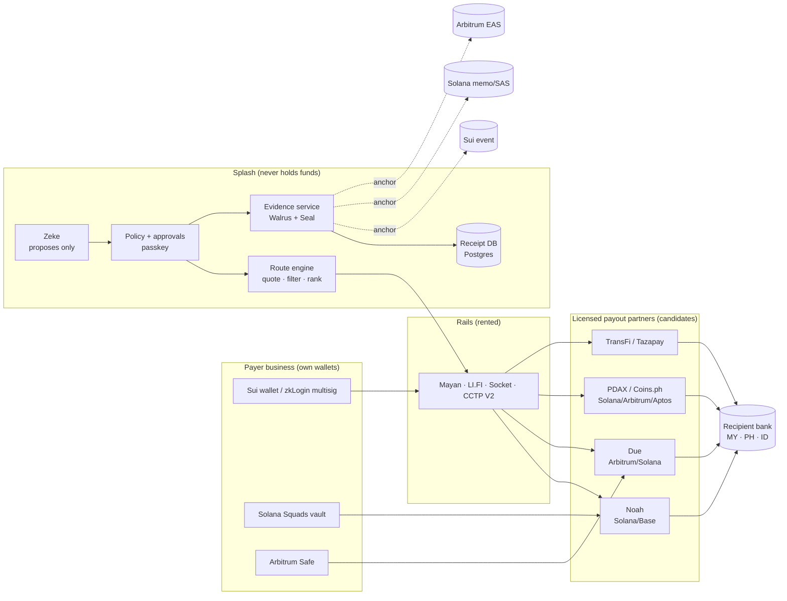
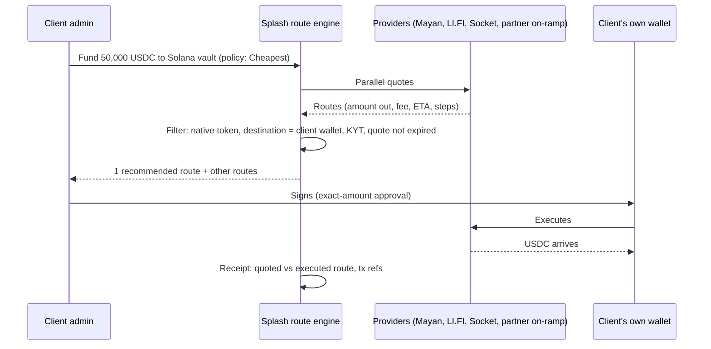

# Splash: the full picture (v15 draft, 3 Oct 2026)

Status: **UNCONFIRMED draft.** Locks only on Sky's "update v14 → v15". Every Move change needs Sebastian's sign-off. Splash is not yet a licensed money-services business. No partner below is signed; none may be named externally.

## 1. One-line model

**A chain-agnostic settlement engine.** The client funds in USDC (or USDT where the partner takes it) on any supported chain. Splash picks the route the client's policy prefers (Cheapest / Fast / Safest). Money lands on whatever chain the licensed payout partner accepts. Sui keeps the record, the approvals and the evidence (Walrus + Seal), anchored on every chain the money touched.

"Transfers are free. We charge for proof."

## 2. Decisions in this draft

| # | Decision | Status |
|---|---|---|
| 1 | Settlement engine is chain-agnostic; partner's accepted chain/token decides the rail | Proposal |
| 2 | **Sui** = record, approvals, evidence, free in-network USDC | Proposal |
| 3 | **Solana** = primary payout rail (Noah, PDAX, Yellow Card, TransFi, Tazapay); Colosseum entry by **12 Oct** | Proposal |
| 4 | **Arbitrum** = EVM rail (Due funding address, PDAX, Coins.ph, Tazapay); Base kept ready | Proposal |
| 5 | **Aptos** = route adapter only (CCTP V2 domain 9 → Coins.ph); no native Move build until a trigger (partner terms, grant, investor) | Proposal |
| 6 | **Noah** = lead off-ramp to Malaysian business bank accounts (Sky's call); Due, TransFi, Tazapay as alternates | Sky decided; terms unconfirmed |
| 7 | Tokens: USDC default; USDT where the partner accepts it (client bears depeg); USDsui funding only; OUSD watch (not live, H2 2026) | Needs I7 rewording |
| 8 | I7 becomes "USD-pegged stablecoins accepted by the corridor's licensed partner" | Needs trigger |
| 9 | Route choice: admin sets policy once; each payment shows one recommended route + "other routes"; receipt logs quoted vs executed | Proposal |
| 10 | Rank routes by **local currency the recipient receives**, not bridge fee | Proposal |
| 11 | Shared KYB: Splash runs Sumsub; shares to partners by Sumsub share token, with the business's consent (Due documents this) | Proposal |
| 12 | Each payer business becomes the payout partner's own customer (Noah Standard model, Due accounts); Splash is technology partner | Proposal |
| 13 | Ringgit on-ramp: business's own account at an SC-registered exchange, or a partner's FPX collection; DCS ruled out | Proposal |
| 14 | Africa: diligence only, nothing built | Proposal |
| 15 | Claim: "non-custodial on-chain; licensed partners hold funds at the fiat edge" | Proposal |

## 3. Stress test in points

**Holds**
- Chain-agnostic settlement: every payout partner checked lives on Solana, Arbitrum, Base or Polygon, not Sui.
- Sui as the proof layer: zkLogin, gasless USDC, Walrus and Seal are native only there.
- Noah for Malaysia: MYR, PHP, IDR listed; Standard model makes the payer business Noah's customer; automated payouts trigger on deposit.
- Due as a second rail: MYR via DuitNow up to RM1,000,000 per payment; PHP InstaPay (₱50k) and PESONet (₱10M); IDR BI-FAST; Arbitrum USDC via a per-transfer funding address that must come from the payer's linked wallet.
- Shared Sumsub KYB: Due imports a Sumsub share token (`POST /v1/kyc/sharing/sumsub`), so one KYB can serve several partners.
- Cheap/fast choice: Mayan and LI.FI already return ranked routes.

**Breaks, with the fix**
- **No partner supports Sui** (Noah, Due, TransFi, Tazapay, Triple-A, BVNK). → Payout money moves on Solana/Arbitrum; Sui-origin money needs a bridge.
- **Circle CCTP V1 on Sui** throttles from 31 Oct, pauses 1 Dec; V2 for Sui promised "before" but undated. → Route-health launch gate; Mayan Swift fallback; fund payouts on Solana/Arbitrum directly.
- **No partner holds a Malaysian licence** (Noah: US/Canada/Lithuania; Due: UK, licences undisclosed; Tazapay: MAS; TransFi: undisclosed). → BNM/counsel question before live MYR volume.
- **Noah contracts Asian businesses through Noah Savings Inc. (Canada)**; local MYR payout partner undisclosed; third-party payout wording conflicts ("second" vs "third" party). → Written answers before go-live.
- **Noah's Reliance model needs a regulated entity.** → Use Standard model; Splash is technology partner.
- **Noah has no Arbitrum, Tron or Sui.** → Solana or Base for Noah.
- **Due: licences undisclosed, UK virtual-office address, seed-stage balance sheet.** → Due is backup until licences are shown.
- **Partners hold funds at the edge** (TransFi and Tazapay payouts are prefunded; Due/Noah deposit addresses are theirs). → Claim "non-custodial on-chain" only.
- **TransFi's Malaysia page cites a "Payment Services Act" of Bank Negara, which doesn't exist.** → Don't rely on its licence claims.
- **Code at 3f78f5a:** operator-signed path on by default; deposit keys derived from a server secret; live USDC lane writes no Sui record; anchor key can forge receipts; Walrus epochs unset; Seal decrypts with operator key; `splash_evidence` missing; no Solana/EVM code. → Section 8 fixes.
- **Multisig weights** (2/2/1/1, threshold 2) let Splash + recovery contact sign. → Remove Splash key or time-lock recovery.
- **Zeke:** WhatsApp APPROVE counts as a vote; `AUTO_EXECUTE` exists; approvals not passkey-bound; Haiku 4.5 retiring. → Section 9.

## 4. Architecture



## 5. Chains: role, stage, what to build

| Chain | Role | Stage | Build |
|---|---|---|---|
| Sui | Record, approvals, evidence; free in-network USDC | Mainnet now | Fix audit defects; `splash_evidence`; batched anchor; user-signed payments only |
| Solana | Primary payout rail | Colosseum by 12 Oct; then production | New repo: Squads vault → partner deposit address, Kora fees, SPL Memo with commitment, SAS anchor |
| Arbitrum | EVM payout rail (Due, PDAX, Coins.ph, Tazapay) | Sepolia spike by 17 Oct | Passkey Safe, zero-balance Solidity router with `Paid` event, EAS root; Base config ready |
| Aptos | Route adapter only | Phase 2 | CCTP V2 domain 9 delivery to Coins.ph; no Move port |

## 6. Funding (fund a wallet)

| Route | Who executes | Chains | Splash's role |
|---|---|---|---|
| USDC already on Sui | Client | Sui | Show address (SuiNS name), free |
| Connect wallet + swap/bridge | Mayan / LI.FI / Socket; client signs | Any → client's own wallet | Quote, rank, lock destination, fee 0 |
| Ringgit via SC-registered exchange | HATA / Luno / SINEGY / MX Global / Kinetic (client's own account) | Exchange withdrawal networks | Referral only |
| Ringgit via partner collection | TransFi (FPX, Boost) / Tazapay (FPX corporate, up to US$20k) | Solana/Arbitrum | Candidate; counsel first |



## 7. Paying out to a Malaysian business bank account (Noah lead)

```mermaid
sequenceDiagram
  participant A as Malaysian payer (approver)
  participant S as Splash
  participant N as Noah (Standard model)
  participant V as Payer's Solana vault
  participant B as Recipient bank (MY)
  Note over A,N: Once: payer business completes Noah KYB (hosted) or Sumsub share; accepts Noah terms
  A->>S: Pay supplier RM 120,000, invoice #INV-88
  S->>N: GET channels/sell?Country=MY → form, limits, fee
  S->>N: Create payout workflow (beneficiary, purpose, originator data)
  N-->>S: Deposit address + expiry + quote
  S-->>A: Recipient gets RM 120,000 · fee · arrival time · route
  A->>V: Passkey approval → vault sends exact USDC to Noah address
  V->>N: USDC (Solana)
  N->>B: MYR via local rail
  N-->>S: Webhook: completed + partner reference
  S->>S: Receipt + evidence (Walrus) + anchors (Sui event, Solana memo)
```

Alternates on the same shape: **Due** (Arbitrum funding address from the payer's linked wallet, DuitNow, RM1M cap), **TransFi** (prefunded balance or per-order address), **Tazapay** (balance-based).

Philippines: PDAX (InstaPay/PESONet, GCash), Coins.ph, Noah, Due. Indonesia: Noah, Due (BI-FAST), TransFi, DurianPay.

## 8. Sui code: keep / change / add / remove (commit 3f78f5a)

- **Remove or disable:** operator-signed payment path (`lib/server/composed-payment.ts`; `LAUNCH_SCOPE` default `full` in `lib/env.ts:186`); server-derived deposit keys (`lib/server/funding-sessions.ts`); `confirmed: true` Stripe/Airwallex stubs; Seal mock key fallback (`seal.ts:72`); free-text `anchor_audit_hash` path.
- **Change:** `receipt_v2::create_receipt` must bind to a real intent and coin movement; Walrus uploads send `epochs` and `permanent=true`; Seal decryption by allowlisted Sui addresses, not the operator key; Splash multisig key weight 0 or time-locked recovery; zkLogin salt decided (server vs Enoki) before any real business address.
- **Add:** `splash_evidence` package (now on branch `feat/v15-splash-evidence`, see §13); call `confirm_with_approval` from TypeScript; batched Merkle anchor via authenticated events; route engine (`RouteQuote` with `acceptedTokens`, net local amount, policy tag); partner adapters (Noah first, then Due, PDAX); Sumsub KYB + share tokens; KYT per route; receipt `splash.receipt.v1`.
- **Keep:** `splash_core` (no balance-holding struct, `check:core`), four separate caps, approval flow in Move, lane guard, 1,099 passing tests.

## 9. Zeke

- **Models:** `claude-sonnet-5-5` for the agent and invoice extraction; `claude-haiku-4-5-20251001` only as a second-pass check (retiring from 15 Oct 2026 at the earliest); `claude-opus-5-5` offline to grade evals.
- **Rules:** proposes, never pays; WhatsApp is notification and intent capture only (remove APPROVE votes); hard-block `AUTO_EXECUTE` for anything Zeke creates; approvals bound to a passkey challenge over the approval hash.
- **Safety:** quarantine pattern (a tool-less model reads invoices and WhatsApp, returns validated JSON); structured outputs; every number in an explanation must appear in source data; log every model call; no vendor names in Walrus memory.
- **New skill:** explain routes in plain words ("Cheapest saves RM 41 but arrives in ~2 hours").

## 10. Fees (D10/D11, unchanged in substance)

- Free between verified Splash businesses on Sui.
- Bank payout: partner cost at cost + about 0.10% (US$2 minimum); honest all-in about 0.30–0.35% on US$2k+ tickets.
- Exit to own wallet: bridge at cost + US$1.
- Plans: Free / Business US$149 (US$99 founding) / Pro US$499.
- Route costs paid by the client at cost; Splash integrator fee 0.

## 11. Lessons from Aqua0 (Malaysian, 1inch and Uniswap incubators)

- Copy: become a sponsor's flagship (Sui zkLogin/gasless, Circle CCTP V2, Solana Kora); turn each hackathon into an incubator ask within two weeks; public line-itemed grant proposals; capped allowlisted pilot; data-led content; a senior angel from a protocol you depend on.
- Don't copy: yield/LP framing; seven-chain sprawl; implied momentum without numbers. Public sources show grants (US$50k from 1inch), incubators and an angel round in progress, not a large raise.

## 12. Decisions from Sky (4 Oct 2026)

| # | Question | Sky's answer | Status | Pushback |
|---|---|---|---|---|
| 1 | First corridors | Noah (MY, ID, PH); PDAX or GCash (PH); DurianPay (ID) | Decided | GCash is not a B2B API you can sign directly; reach it through PDAX/Toku or Noah. Noah's MY payout licensee is still unnamed. |
| 2 | Splash key in the wallet | Joint control as an opt-in company setting: default 1 signature, 2 signatures when switched on | Decided | The second signer must be a **company member**, never Splash. See §13. |
| 3 | `splash_evidence` | On `sky9484/phase1` branch `feat/v15-splash-evidence` (7c8b363) | Found | Reviewed in §13. `mega-ideas/latest-splash` has nothing newer than 3f78f5a. |
| 4 | zkLogin salt | Sebastian builds Enoki before 6 Oct; server salt until then | Decided | `feat/v15-wallet` already resolves Enoki first and keeps a sealed copy. Don't create real business wallets on server salt; addresses change when you switch. |
| 5 | First clients | Find 10 and contact them | Done | See `potential-clients-2026-10-04.md`. Only 3 are strong fits. |
| 6 | I7 wording for USDT | Approved | Decided | USDT is not gasless on Sui; the client carries depeg risk, and the UI must say so before funding. |
| 7 | Screening (KYT) | Pay-per-check now; Elliptic later, with Sui's help via Overflow 2026 | Decided | Screen both payer and recipient wallets on every payout, not just onboarding. Check whether Elliptic credits from Overflow have an expiry date. |
| 8 | Counsel / BNM | Needed. Sky suggests Wise, Airwallex, TerraPay, XTransfer | Decided; checked in §14 | Only Airwallex fits as an API partner. |

## 13. Review of Sky's new branches (sky9484/phase1, CI green, no PRs open)

**`feat/v15-splash-evidence` (7c8b363): keep, with two fixes.**
- Good: holds no value (no `Coin`/`Balance`); frozen anchors; `anchor_for` requires bundle membership; grants are revoked when any member is removed; the namespace stops one bundle's list opening another. 21/21 tests on CLI 1.77.2.
- **Privacy leak:** `Allowlist.members` is a public vector on a shared object. Payer, recipient and partner addresses for each bundle are readable by anyone, so the chain shows who pays whom. That breaks the WS5 "commitments only" rule. Fix: list members as the org multisig addresses (not people) and accept the counterparty link, or make the recipient member a per-bundle derived address.
- **Cost at scale:** one frozen object per anchor means storage that never gets rebated. Fine for pilots; switch to batched Merkle roots in events past ~1k receipts a day.
- Still needs Sebastian's sign-off; extend `check-core-no-balance.mjs` to cover this package.

**`feat/v15-wallet` (a5ab2e5): good base, one honesty issue.**
- Today: threshold 2; admin 2 and backup 2 (each can sign alone); recovery contact 1; Splash cold key 1.
- **Flaw:** a Sui multisig signs any transaction, not just "migration". So recovery contact plus Splash's cold key can move funds, and the 72-hour notice is only enforced by our server. That is co-signing, so disclose it in the terms and the wallet screen. Do not call it "Splash can never move funds".
- **Dual control (Sky's #2), proposed weights:**

| Mode | Threshold | Admin | Second approver | Recovery contact | Splash cold |
|---|---|---|---|---|---|
| Single (default) | 2 | 2 | (backup 2) | 1 | 1 |
| Dual control | 4 | 2 | 2 | 3 | 1 |

- Check of the dual mode: admin + approver = 4 ✓; admin + Splash = 3 ✗; approver + Splash = 3 ✗; recovery + Splash = 4 (the recovery path, same risk as today); Splash alone = 1 ✗. Splash plus one employee can never pay.
- **Switching mode is a wallet migration** (members and threshold set the address), so it means a new address and a sweep. Turning dual control **off** must need both signatures, or one admin can quietly remove the second.

**`feat/v15-approval-dead-end` (1367e07): merge.** It refuses approvals that can only fail before anyone signs.

**`feat/v15-sui-skills` (8ef7d2c): merge after removing `.agents/skills/your-skill-name/`**, which is an empty template.

## 14. BNM-licensed parties for the ringgit leg (checked 4 Oct)

| Provider | Verified Malaysian status | Takes USDC in? | Platform API for MY businesses | Verdict |
|---|---|---|---|---|
| **Airwallex** (Malaysia) Sdn Bhd | **Class A MSB, active on BNM** (approved 31 Mar–1 Apr 2026); e-money issuer; merchant acquirer | No. USDC payouts out (Ethereum, early access) only | **Yes.** Connected Accounts support Malaysia, with KYB via API | **Best fiat partner.** The business sells USDC → MYR at an SC exchange or Noah, then Airwallex pays PH/ID/MY. Ask about stablecoin funding. |
| Wise Payments Malaysia Sdn Bhd | e-money issuer on BNM; remittance licence (class unverified); direct PayNet since 30 Jul 2026 | No | Wise Platform sells to banks and fintechs; otherwise each business opens its own account | **Avoid as a partner.** Its rules ban businesses that exchange or trade crypto, so Splash risks closure. "80% instant" is really 77% within 20s, globally. |
| TerraPay | Class B, per its own release (4 Jun 2025); not confirmed on BNM | Yes, at network level (Fipto, PalWallet); not confirmed for MY | Wholesale only, to banks and licensed firms | Only usable behind a licensed partner or once Splash has its own MSB licence. |
| XTransfer | **Conditional approval only** (26 Feb 2026) for Class A + e-money; not live | Plans stablecoin collection | None in MY yet | Not usable. Watch it. |

- **Better answer for #8:** keep Noah as the stablecoin off-ramp and add **Airwallex as the licensed MYR/PH/ID payout rail**. Ask counsel whether "Noah sells USDC → Airwallex pays" puts a BNM licensee on the ringgit leg in the right place.
- Also worth one email: **Tranglo** (Ripple holds 40%) and **SUNRATE**. Both are BNM-licensed and close to crypto; neither has verified stablecoin flows.

## 15. Still open

1. Noah: the named licensee paying MYR, and whether third-party B2B payouts are allowed.
2. Circle: a date for CCTP V2 on Sui before 31 Oct.
3. Solana work dated after 14 Sep, and forwarder LOIs by 12 Oct (Colosseum).
4. Counsel engagement letter (Ethos or similar) with the questions in the contact list.
