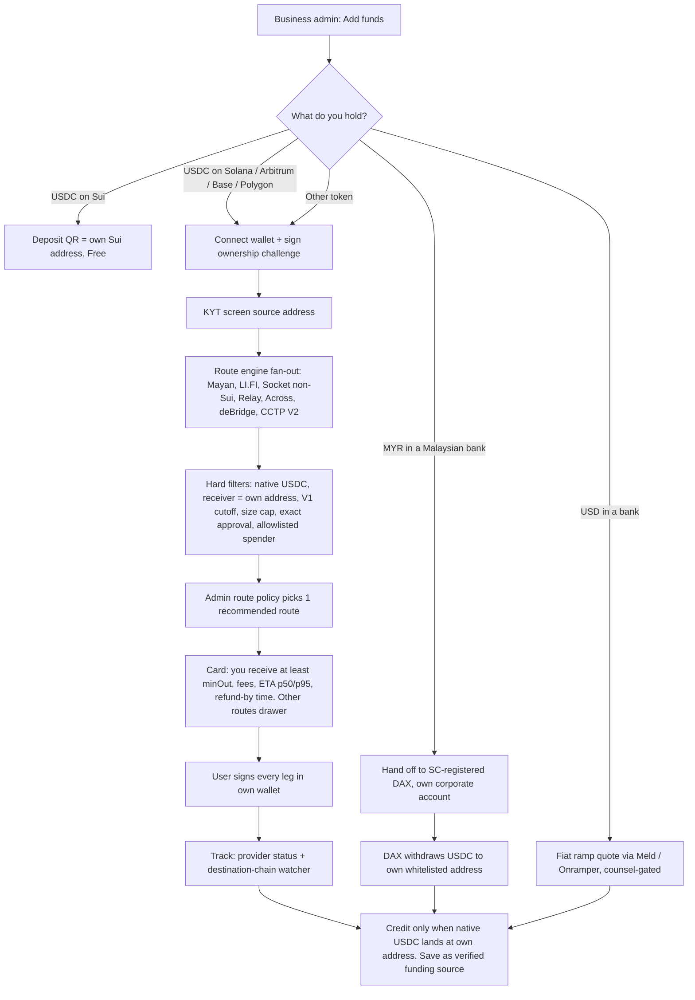
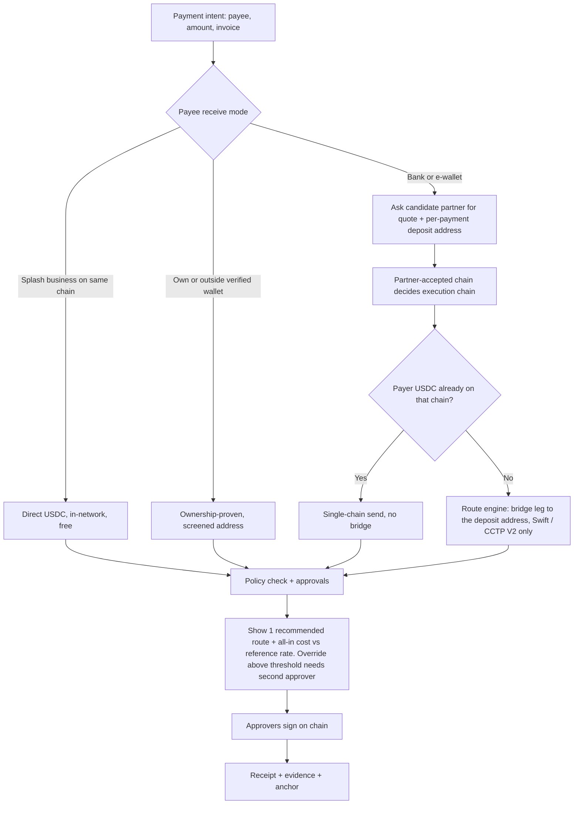
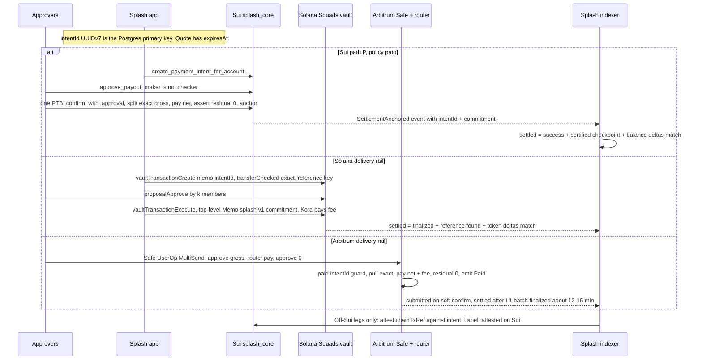
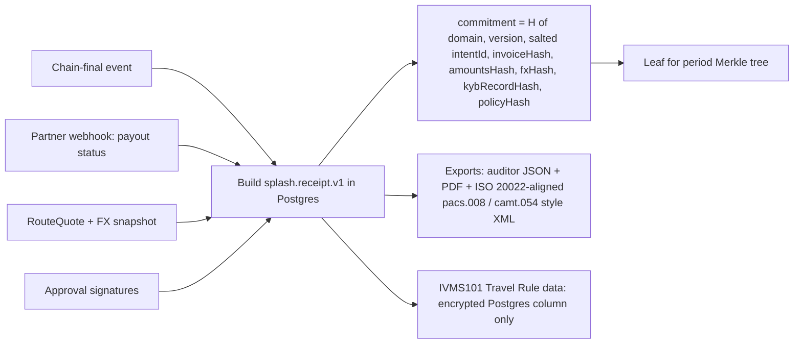
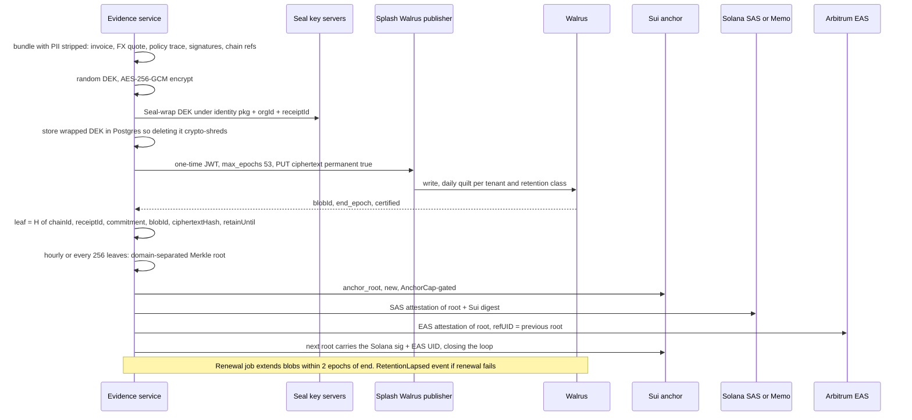
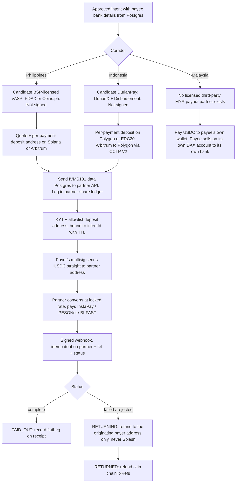
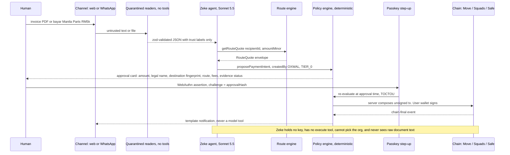

# Build the route, prove on Sui

**Bottom line for Sebastian and Sky (as of 3 Oct 2026).** DCS is not the holy grail. It is a Singapore card issuer regulated by MAS, and in Jupiter's DuitNow QR product it sits on the payer's side, not the merchant's. It does not appear anywhere on an honest MYR leg. The MYR route that works today is first-party: a Malaysian business uses its own account at an SC-registered digital asset exchange (DAX). Splash only orchestrates that route and never touches the ringgit. The "route layer" Sky wants does exist. LI.FI, Socket V3, Rango and Mayan all return lists of priced, executable routes. On Sui, though, the list shrinks to roughly one rail family (Mayan), and after Circle pauses CCTP V1 on 1 Dec 2026 it shrinks to one solver network (Mayan Swift). So the right design is to move the money on whichever chain the licensed payout partner accepts (Solana or Arbitrum for the Philippines), keep the record and the evidence on Sui and Walrus, show one recommended route by default with an override drawer, and log every choice as a best-execution record. The code at `3f78f5a` (phase1 and latest-splash are byte-identical) gives a strong base: a zero-balance `splash_core`, on-chain four-eyes approval, a user-signed USDC lane, and a Zeke that can only read and propose. It also carries custodial and demo paths that must go before real money moves:
- Splash-derived deposit keys.
- An operator-signed "full" payment path, which is the default `LAUNCH_SCOPE`.
- `confirmed: true` stubs in the Stripe and Airwallex code.
- An operator-key Seal decrypt.

There is no Solana or EVM code in the repo, and the v15 `splash_evidence` package is not in either clone. Everything below is a proposal: UNCONFIRMED until Sky triggers v15, and every Move change needs Sebastian's sign-off. Splash is not licensed, and the payout venues named here are candidates, not partners.

## A. Stress test: 9 holds, 14 breaks, each with a fix

**Holds**
- **Zero-balance Sui core.** `splash_core` holds no `Balance`, and the `check:core` guard passes. Source: `move/splash_core/Move.toml`, `scripts/check-core-no-balance.mjs`.
- **On-chain four-eyes approval already exists.** `mint_approval` rejects self-approval, and a bound intent can settle only through `confirm_with_approval` (`business_account.move:839-844`, `payment_intent.move:371-448`).
- **M1 is fixed.** A `SettleReceipt` is minted only after the coin moves (`payment_intent.move:450-501`).
- **The USDC lane is the right pattern.** The user signs, and Splash dry-runs, submits and verifies (`lib/server/stablecoin-send.ts:31-45`, `lib/server/stablecoin-chain.ts:106-133`).
- **Zeke cannot pay.** It has read and propose tools only, an assertion that no execution tool exists, the org injected server-side, and a lane guard that runs before the model (`lib/agent/oxwal.ts:235-280, 504-536`, `lib/agent/zeke-lane-guard.ts`).
- **Tests are green.** All 1,099 Node tests and all 11 `check:*` guards pass. Move tests did not run, because there is no `sui` CLI in this environment.
- **Route APIs exist.** LI.FI, Socket V3, Rango and Mayan return route arrays ([LI.FI](https://docs.li.fi/api-reference/advanced/get-a-set-of-routes-for-a-request-that-describes-a-transfer-of-tokens), [Socket](https://docs.socket.tech/api-reference/swap/get-quotes.md), [Rango](https://docs.rango.exchange/api-integration/main-api-multi-step/api-reference/get-all-possible-routes.md), [Mayan](https://docs.mayan.finance/build/sdk/fetching-quotes.md)).
- **Philippine exits take Solana and Arbitrum USDC.** PDAX added USDC on Solana in June 2024 and on Arbitrum in December 2025 ([PDAX](https://learn.pdax.ph/post/usdc-for-solana-now-available-on-pdax), [PDAX](https://learn.pdax.ph/post/pdax-learn-usdc-on-arbitrum-is-now-on-pdaxZ)).
- **Walrus works from any chain**, through a Splash-run authenticated publisher. There is no public publisher on mainnet ([Walrus](https://docs.wal.app/usage/web-api.html)).

**Breaks → fix**

| # | Breaks | Fix |
|---|---|---|
| 1 | "DCS is the licensed MY acquirer Jupiter uses." DCS is in Singapore, regulated by MAS, and is Jupiter's *issuer* ([DCS](https://dcscc.com/about-us), [Jupiter](https://docs.jup.ag/user-docs/global/spend/jupiter-card.md)) | Drop DCS from the MYR plan. MYR goes through an SC-registered DAX, on the business's own account |
| 2 | Route picking as the moat. LI.FI alone moved US$5bn+ in January 2026 ([LI.FI](https://li.fi/knowledge-hub/li-fi-update-january-2026)) | Sell the route *policy* and the best-execution log, not the menu |
| 3 | A Sui route menu after 1 Dec. Sui is on CCTP V1 only ([Circle](https://developers.circle.com/cctp/cctp-supported-blockchains)). Socket returned 0 Sui USDC routes on 28 Sep (v15 §6). Allbridge dropped its pools ([The Block](https://theblock.co/post/408855/allbridge-core-exploit)) | Pay out on the partner's chain. Use Mayan Swift as the only bridge after 1 Dec, with a fallback ladder (§D) |
| 4 | The "full" payment path is custodial in substance. The operator key pays from its own gas coin, and `LAUNCH_SCOPE` defaults to `full` (`lib/server/composed-payment.ts:35-70`, `lib/env.ts:186`) | Delete the path. Set `stablecoin` scope in production now |
| 5 | Deposit addresses are derived from a server secret, so Splash can re-derive the private keys (`lib/server/funding-sessions.ts:55-101`) | Remove them. Funding lands only in the user's own address |
| 6 | The weighted multisig in v15 §4. The Splash cold key (weight 1) plus the recovery contact (weight 1) reach the threshold of 2 and can sign *any* transaction, not only a migration | Set the Splash key to weight 0, or disclose joint control (Q2) |
| 7 | "Every send writes a Sui record." The USDC lane writes none (`anchorStatus: 'PENDING_MAINNET_PUBLISH'`, `lib/server/stablecoin-outflows.ts:145`). No TypeScript calls `confirm_with_approval` | Wire the account-bound PTB (§C) |
| 8 | "Off-Sui payouts carry Sui receipts." A `SettleReceipt` exists only if a `Coin<T>` moved on Sui | Use two claim words: "Sui-settled" and "attested on Sui" |
| 9 | Receipt forgery. `receipt_v2::create_receipt` accepts sender, recipient and amount from the caller (`receipt_v2.move:87-141`) | Bind it to an intent, or delete it |
| 10 | Evidence retention. Walrus is called with no `epochs` parameter while the record claims 5 (`lib/server/walrus.ts:43-108`) | `permanent=true`, 53 epochs, and a renewal job |
| 11 | "Only the counterparties can read the evidence." Seal decrypts with the operator key, and the allowlist lives in a server-side Map (`lib/server/seal.ts:128-184`) | Seal model B: an on-chain allowlist and client-side decrypt |
| 12 | `splash_evidence` (v15 §8, commit `7c8b363`). It is not in either clone. `move/` holds only core, custody and meter | Sebastian confirms where it lives. Until it is published, say "recorded, anchor pending" |
| 13 | Zeke canon. WhatsApp APPROVE replies can cast votes, the policy engine has an `AUTO_EXECUTE` outcome, and chat approvals are not tied to a passkey (`app/api/webhooks/whatsapp/route.ts`, `lib/policy/evaluate.ts:125-212`, `app/api/proposals/[id]/submit/route.ts`) | Remove reply-mode APPROVE. Agents can never auto-execute. Approvals require a passkey bound to the approval hash |
| 14 | Colosseum on 12 Oct. There is zero Solana code (`package.json` has no `@solana/*`). Only work done since 14 Sep is judged ([Colosseum](https://www.colosseum.com/hackathon)). K4 LOIs = 0 | Build one Solana flow in a clean repo. LOIs count for more than code |

## B. Target architecture: money on the partner's rail, proof on Sui

There are three planes:
- **Money:** the user's own wallet, connected to the partner's per-payment deposit address.
- **Authority:** an on-chain approval on the chain where the money moves.
- **Evidence:** Walrus and Seal on Sui, with one period root anchored on all three chains.

Splash's server holds a storage and anchor payer key (SUI and WAL only) and nothing that can move, freeze or approve customer money.

### B1. Route picking when funding a wallet



### B2. Route picking when sending a payment



### B3. Transfer and settlement on each chain



Finality rules come from [Sui](https://docs.sui.io/concepts/sui-architecture/transaction-lifecycle) (400–700 ms, checkpoint inclusion), [Anza](https://docs.anza.xyz/consensus/commitments) (`finalized` under Tower BFT; Alpenglow is not confirmed live) and [Arbitrum](https://docs.arbitrum.io/how-arbitrum-works/deep-dives/finality) (about 12–15 minutes for parent-chain finality). Never re-sign on a timeout. Re-query the digest, signature or UserOp receipt instead.

### B4. Receipt



### B5. Audit anchor: Walrus plus an anchor on each chain



### B6. Payout to a local bank: Philippines, Indonesia, Malaysia



The facts behind this chart:
- PDAX already pays PHP to GCash and GrabPay over InstaPay and PESONet for third-party stablecoin payroll ([Business Wire](https://www.businesswire.com/news/home/20251118568241/en)).
- The Coins.ph cash-out API has `internalOrderId` and three statuses: pending, success and failed ([Coins Access API](https://coins-access-api.readthedocs.io/en/latest/fiat-wallet-related.html)).
- Neither PDAX nor Coins.ph publicly documents a per-payment deposit-address API. That is the main integration unknown.
- In Malaysia, no SC-registered DAX was found to hold an MSB remittance licence. Paying ringgit to a third party is remittance under MSBA 2011 ([Azmi & Associates](https://www.azmilaw.com/insights/overview-of-the-regulatory-framework-for-money-services-in-malaysia/)).

### B7. Zeke's propose → approve → execute loop



## C. Build list: Sui now, Solana by 12 Oct, Arbitrum next

### C1. Sui (main build, now to mainnet): keep, change, add, remove

| Action | Item (file) |
|---|---|
| **Keep** | `payment_intent` with its hot-potato `SettleReceipt`; `audit_anchor::anchor`; `business_account` four-eyes; `cap_registry`; `spend_window`; all `check:*` guards; the env contract (`lib/env.ts`); auth and membership; passkey (`lib/auth/passkey.ts`); zkLogin used for login only (`lib/auth/zklogin.ts`); the user-signed USDC lane; Zeke's read/propose split; approval replay (`lib/server/approval-execution.ts`) |
| **Change** | Make `create_payment_intent_for_account` → `approve_payout` → `confirm_with_approval` → `anchor` the only production path, user-signed, rebuilt in `lib/server/sui-settlement.ts` and `lib/server/ptb.ts` |
| **Change** | Drop the per-payment `anchor_audit_hash` call from the composed PTB (`sui-settlement.ts:862-917`) |
| **Change** | Length-check `content_hash` (32 bytes) and the blob ID, and pass raw digests rather than UTF-8 strings (`audit_anchor.move:165-166`, `sui-settlement.ts:874-882`) |
| **Change** | Bind or delete `receipt_v2::create_receipt` |
| **Change** | Move SSM numbers and KYB cleartext off the shared `BusinessAccount` (`business_account.move:416-459`). Land the WS5 commitment-only events |
| **Change** | Walrus: pass `epochs`, use `permanent=true`, add a renewal job (`lib/server/walrus.ts`). Seal: on-chain allowlist and client-side decrypt (`lib/server/seal.ts`) |
| **Change** | Make evidence approvals reference on-chain `PayoutApproved` events rather than `'dashboard-operator'` JSON (`lib/evidence/settlement.ts:109-116`, `app/api/transfers/authorize/route.ts:574-576`) |
| **Change** | Republish testnet from current source. The published package `0xae1f…` predates WS5 and Phase 6–7 |
| **Add** | `anchor_root(root, period, leafCount)` emitting `emit_authenticated` (core uses plain events today) |
| **Add** | An attestation entry for off-Sui legs (`attest_external_leg(intent, chainId, txRef, commitment)`, AnchorCap-gated) |
| **Add** | `routes`, `route_legs`, `route_quotes`, `payout_orders`, `model_calls` tables in `lib/db/schema.ts` |
| **Add** | Enoki sponsorship scoped to `allowedMoveCallTargets` for path P ([Enoki](https://docs.enoki.mystenlabs.com/ts-sdk/sponsored-transactions)) |
| **Add** | An indexer matching path-G gasless sends, labelled "off-chain matched" |
| **Remove** | `splash_custody` and `splash_meter` from scope. Pooled `SettlementPool` funds contradict the canon |
| **Remove** | Server-derived deposit addresses (`funding-sessions.ts:73-82`) |
| **Remove** | The operator-funded composed payment and the test-recipient override (`composed-payment.ts`, `sui-settlement.ts:681-768`) |
| **Remove** | `HELD_BALANCE` (`lib/funding/registry.ts`) |
| **Remove** | The Stripe and Airwallex `confirmed: true` stubs (`lib/server/stripe.ts:47-73`, `lib/server/airwallex.ts:13-41`) |
| **Remove** | The mock Shinami path (`lib/sui/gas.ts`) |
| **Remove** | The Seal mock key fallback (`seal.ts:72`) |

**Sui wallets.**
- **Paying account:** a Sui multisig (zkLogin, passkey and hardware members).
- **Signers:** Slush, Enoki zkLogin (once a prover is built; today zkLogin cannot sign), passkey, Ledger.
- **Receive only:** Suiet, Nightly, OKX, Backpack, Bitget and Trust, each after a 0.01 USDC address-balance test ([Sui docs](https://docs.sui.io/onchain-finance/asset-custody/address-balances/migrate-address-balances)).
- **Refuse:** Phantom (exited Sui on 24 Sep, [Solana Compass](https://solanacompass.com/news/phantom-wallet-ends-sui-support-on-september-24-2026)). Downgrade the MetaMask Sui Snap to receive-only. Keep Wallet Standard discovery (`lib/wallet/sui-signers.ts`). The legacy `@mysten/dapp-kit` is deprecated, so use `@mysten/dapp-kit-react` if it is adopted ([Mysten](https://sdk.mystenlabs.com/dapp-kit)).

### C2. Solana (Colosseum, due 12 Oct): one flow only, in a new repo with dated commits

| Action | Item |
|---|---|
| **Add (by 10 Oct)** | `@solana/kit` + `@solana/kit-plugin-wallet` ([solana.com](https://solana.com/docs/frontend/web3-compat.md)) |
| **Add (by 10 Oct)** | A Squads V4 vault: `vaultTransactionCreate` → `proposalCreate` → `proposalApprove` → `vaultTransactionExecute` ([Squads](https://docs.squads.so/main/development/typescript/instructions/create-vault-transaction)) |
| **Add (by 10 Oct)** | USDC `transferChecked` to a **clearly labelled mock partner deposit address** on devnet, with a `reference` key and a top-level Memo carrying the commitment only |
| **Add (by 10 Oct)** | Kora as fee payer, restricted to Squads, Token, ATA and Memo ([Kora](https://solana.com/docs/tools/kora/getting-started)) |
| **Add (by 10 Oct)** | Evidence through the Splash Walrus publisher (testnet, labelled), with the Solana signature written into the Sui testnet record |
| **Add if time allows** | An SAS KYB credential; Jupiter for USDT→USDC at 0 bps |
| **Do not build for Colosseum** | The full route engine, fiat ramps, LazorKit passkeys (needs a spike first), consumer flows |
| **Disclose** | The Sui build, the Walrus/Seal adapters and the web app as prior work |

**Solana wallets.** Paying account: a Squads vault. Signers: Phantom, Solflare, Backpack, Ledger. Embedded Privy or Turnkey wallets are allowed only as one member of the vault, never as its sole authority.

### C3. Arbitrum (next; Sepolia spike by 17 Oct)

| Action | Item |
|---|---|
| **Add** | wagmi + viem 2.x + Reown AppKit for SIWE ([wagmi](https://wagmi.sh/react/getting-started), [Reown](https://docs.reown.com/appkit/overview)) |
| **Add** | A Safe ≥1.4.1 owned by passkeys through the WebAuthn signer |
| **Add** | A plain Solidity router (not Stylus) with `paid[intentId]`, exact pull, a residual-zero assert, a `Paid` event, no admin function that can move funds, and native USDC `0xaf88…5831` only (refuse USDC.e) |
| **Add** | MultiSend: approve → pay → approve 0 |
| **Add** | A Pimlico paymaster on EntryPoint v0.7 or v0.8; v0.9 has no paymaster ([Pimlico](https://docs.pimlico.io/guides/supported-chains)) |
| **Add** | An EAS root schema (EAS v0.26 at `0xbD75…c458`) |
| **Remove / never** | A Splash module, guardian or allowance in any customer Safe |

**Arbitrum wallets.** Paying account: a Safe. Signers: MetaMask, Coinbase Smart Wallet, WalletConnect wallets, the Safe passkey signer.

### C4. Integrations to plumb, by stage

| Integration | Sui now | Solana by 12 Oct | Arbitrum next |
|---|---|---|---|
| Mayan SDK (`fetchQuote`, explorer status) | Yes: funding into Sui, exits | Quote display only | Yes |
| LI.FI `/advanced/routes` + `/v1/status` | Only for real swaps; dedupe against Mayan | Later | Yes |
| Socket V3 | **No** (0 Sui routes on 28 Sep) | Later | Yes |
| Relay / Across / deBridge / own CCTP V2 builder | n/a | Later | Yes |
| Cetus / 7K / Aftermath | Same-chain swaps on Sui | n/a | n/a |
| Jupiter | n/a | Edge swaps | n/a |
| Enoki (sponsor, zkLogin prover) | Yes | Seal identities for Solana users | Seal identities for EVM users |
| KYT (Chainalysis or TRM) | Required by the route filter | Same | Same |
| Payout adapters | Mock until a partner signs | Mock, labelled | Mock |

## D. Route-engine spec: fan-out, filter, rank, then one recommended card

**Providers per corridor**

| Corridor | Route-array calls | Single-quote fan-out | Same-chain leg | After 1 Dec |
|---|---|---|---|---|
| Fund Sui from EVM or Solana | Mayan (all types), LI.FI (toChain Sui `9270000000000000`) | — | Cetus / 7K / Aftermath | **Mayan Swift only** |
| Fund Solana | LI.FI, Socket V3, Mayan | Relay, Across, deBridge, Squid, CCTP V2 Standard + Fast | Jupiter | All survive |
| Fund Arbitrum | LI.FI, Socket V3, Mayan, Rango (optional) | Same as Solana | 0x / Odos / 1inch / Socket | All survive |
| Sui → Solana / Arbitrum / Base / Polygon | Mayan, LI.FI (wraps Mayan) | — | Cetus if not USDC | **Swift only, capacity-bound** |
| Solana ↔ Arbitrum | LI.FI, Socket V3, Mayan | CCTP V2 direct, Relay, Across, deBridge, Squid | — | All survive |
| Arbitrum → Polygon (Indonesia candidate) | LI.FI, Mayan | CCTP V2 direct | — | All survive |
| Fiat USD → USDC | Meld `quotes[]`, Onramper ranked list ([Meld](https://docs.meld.io/api-reference/crypto/retail-ramp/crypto-quote-get), [Onramper](https://docs.onramper.com/docs/recommendations-and-onramp-ranking.md)) | — | — | n/a; counsel-gated |
| MYR ↔ USDC | **None.** Handoff to the business's own SC-DAX account | — | — | n/a |

**`RouteQuote` schema (TypeScript)**

```ts
type RailClass = 'CANONICAL_BURN_MINT'|'INTENT_SOLVER'|'LIQUIDITY_POOL'|'LOCK_MINT_WRAPPED'|'FIAT_RAMP'|'DAX_HANDOFF';
interface RouteQuote {
  quoteId: string; intentId: string;            // one intent ↔ one selected quote
  provider: 'mayan'|'lifi'|'socket'|'rango'|'relay'|'across'|'debridge'|'squid'|'cctp-v2'|'meld'|'onramper';
  rails: string[];                              // e.g. ['mayan-swift'] or ['cctp-v1','mayan-mctp'] — dedupe key
  railClass: RailClass; cctpVersion?: 1|2;
  srcChain: string; dstChain: string;           // CAIP-2
  srcToken: string; dstToken: string;           // dstToken ∈ canonical USDC allowlist
  amountIn: string; expectedOut: string; minOut: string;   // integer minor units as strings
  fees: { srcGasUsd: string; dstGasUsd: string; protocolBps: number; relayerUsd: string; integratorBps: 0 };
  netReceivedUsd: string;                       // minOut×px − user-paid gas
  etaP50Sec: number; etaObservedP50?: number; etaObservedP95?: number;
  steps: { type:'approve'|'swap'|'bridge'|'claim'|'fiat'|'handoff'; chain: string; signer: 'user'|'kora'|'paymaster' }[];
  approvalSpender?: string; receiver: string;   // decoded from txData, not from the request
  refundBy?: number;                            // Mayan deadline64
  expiresAt: number; maxSize?: string;
  riskScore: number; tags: ('RECOMMENDED'|'CHEAPEST'|'FASTEST'|'SAFEST'|'LEGACY_RAIL')[];
  rejections?: { provider: string; reason: string }[];  // Socket includeQuoteRejections
}
```

**Hard filters (fail closed, before anything is shown)**
- `dstToken` must be native Circle USDC. Drop `LOCK_MINT_WRAPPED`. Treat LI.FI `DONE + PARTIAL` (delivery in a different token) as an incident ([LI.FI](https://docs.li.fi/llms.txt)).
- `receiver` must equal the user's own verified address, or a partner deposit address fetched by API for this intent. **Decode the txData or PTB and check the encoded recipient**, because aggregators accept any recipient.
- KYT on both the source and the destination address. Mayan and Squid screening is a second layer, not the control.
- Exact approvals only, and `approvalSpender` must be on a per-chain allowlist. Never ask for an infinite approval.
- Drop the route if the amount exceeds the provider's maximum size.

**Ranking**
- Three ranks: Cheapest (highest `netReceivedUsd`), Fastest (lowest observed p50), Safest (lowest `riskScore`).
- `riskScore` inputs: rail class weight, incidents in the last 24 months, number of signatures, Splash's observed refund rate, and the share of maximum size used.
- **Default = the Safest route within 10 bps of the Cheapest.** Show at most 3–5 cards in the drawer.
- The admin's route policy (for example "native USDC only, settles within 30 minutes, licensed venue") overrides the default. An override above a threshold needs a second approver.

**Execution**
- Re-quote only the chosen provider when the user confirms. If `minOut` falls by more than 5 bps, or the receiver or spender changes, re-confirm.
- Default TTL is 30 s unless the provider gives one (Relay `ttl`, Mayan `deadline64`).
- Persist the state and step index before prompting the wallet. After a reload, query status by `quoteId` or source transaction hash before allowing a retry.
- The destination-chain watcher is the final truth: PENDING → SRC_CONFIRMED → DST_SETTLED / REFUNDED / FAILED / PARTIAL_EXCEPTION.

**CCTP V1 fallbacks**
- Circle says the V1 phase-out "will commence on October 31, 2026" ([Circle](https://www.circle.com/cctp)), and the contracts pause on 1 Dec ([CryptoSlate](https://cryptoslate.com/circle-gives-legacy-usdc-apps-95-days-before-old-cross-chain-transfer-routes-stop-working/)).
- **Now to 30 Oct:** tag V1 routes "Legacy rail".
- **31 Oct to 30 Nov:** allow a V1 route only if the amount is at or below the current burn limit, and deprioritise it.
- **From 1 Dec:** drop V1 routes entirely. This removes Mayan Standard MCTP on Sui, Wormhole Connect CCTP and the rebuilt Allbridge.
- **Ladder for the Sui leg:**
  1. Mayan Swift.
  2. Swift split into chunks, with the user's consent.
  3. A partner Sui-native deposit address, so no bridge is needed.
  4. Advise funding on Solana or Arbitrum.
  5. USDT, only with an explicit "different asset" confirmation.
- **This breaks the v15 Indonesia pilot after 1 Dec.** Its Sui→Polygon leg runs on Mayan MCTP, which uses V1. Move it to Arbitrum→Polygon over CCTP V2.

**Fees.** The integrator fee is 0 on every provider, and route costs pass through at cost (D10). Negotiate LI.FI's own 0.25% down; Safe's tiers show it is negotiable.

## E. Receipt and anchor spec: one Postgres receipt, three on-chain anchors

**`splash.receipt.v1`** is the canonical record. It lives in Postgres and is versioned.

| Field | Content | ISO 20022 / IVMS101 | Where it lives |
|---|---|---|---|
| `receiptId`, `intentId`, `uetr` | UUIDv7, UUIDv7, UUIDv4 | `Ntfctn/Id`, `EndToEndId`, `UETR` | PG; on-chain only as `H(salt‖intentId)` |
| `invoiceRef`, `invoiceHash` | number, date, MyInvois/BIR UUID; salted hash | `RmtInf/Strd` | PG; encrypted PDF on Walrus |
| `payer` / `payee` | verifiedEntityId, KYB tier/expiry, record hash | `Dbtr` / `Cdtr`; IVMS `legalPerson` | PG only |
| `payerAccount` / `payeeAccount` | CAIP-10 address, or partner deposit address | `DbtrAcct` / `CdtrAcct` | PG |
| `amounts`, `fees[]`, `chargeBearer` | gross, fee, net as integer minor units; fee kinds; default `DEBT` | `IntrBkSttlmAmt`, `ChrgsInf`, `ChrgBr` | PG |
| `fx` | pair, decimal rate, quoteId, source, quotedAt, lockedUntil, executedRate | `XchgRate` | PG + Walrus snapshot |
| `route` | `routeQuoteId`, executionChain, payoutChain, bridge {provider, srcTx, dstTx}, partner, **reason chosen**, **override by** | `SttlmInf`, `IntrmyAgt1` | PG (best-execution log) |
| `chainTxRefs[]` | CAIP-2 chain, txId, kind (execute / bridge / anchor / refund), finality, finalAt | `TxDtls/Refs/TxId` | PG |
| `approvals[]` | approver address, role, signature, payload hash, on-chain approval event ID | — | PG; signatures in the encrypted bundle |
| `travelRule` | required, threshold, IVMS101 payload ref, channel | IVMS101 | Encrypted PG column only |
| `fiatLeg` | partner + licence, `partnerOrderRef`, rail, quoted/executed rate, landed amount, masked account, status history | `AcctSvcrRef`, `AmtDtls`, `BookgDt`, `ValDt` | PG |
| `evidence` | blobId, quilt patch, ciphertextHash, sealPolicyId, retainUntil | — | PG + leaf |
| `anchor` | leafHash, root, proof[], suiAnchorTx, solanaAnchorTx, arbitrumAnchorUid | — | PG; roots on chain |
| `claimLevel` | `SUI_SETTLED` or `ATTESTED_ON_SUI` | — | PG + UI copy |

**Placement rules**
- **On chain:** commitments and roots only.
- **Postgres:** the receipt, salts, KYB data, IVMS101 payloads and wrapped DEKs.
- **Walrus (Seal-encrypted):** business evidence with personal fields removed. Walrus data is public and deletion is not guaranteed ([Walrus](https://docs.wal.app/docs/data-security.md)).

**Anchors**
- **Sui:** a new `anchor_root` emitting `emit_authenticated` ([Sui](https://docs.sui.io/develop/accessing-data/authenticated-events)), gated by `AnchorCap` on a key separate from AdminCap.
- **Solana:** an SAS attestation, with a signed Memo as fallback ([SAS](https://solana.com/docs/tools/attestations/overview)).
- **Arbitrum:** an EAS attestation with `refUID` pointing to the previous root, which makes the roots a hash chain ([EAS](https://github.com/ethereum-attestation-service/eas-contracts)).

**Storage cost.** US$0.023/GB/month of encoded size; a blob can be bought at most 53 two-week epochs ahead ([Walrus](https://blog.walrus.xyz/announcing-predictable-pricing-in-usd-on-walrus/)). Seven-year retention therefore needs renewals.

**Auditor check (7 steps, as a CLI or web verifier)**
1. Recompute the invoice hash and the commitment.
2. Rebuild the leaf.
3. Verify the Merkle proof.
4. Find the root on any one chain.
5. Confirm the payment transaction carries the same commitment and that the token deltas match.
6. Re-encode the blob to check its ID, and check that it is certified, not deletable, and that `end_epoch` is still in the future.
7. Decrypt under the auditor's own allowlisted Sui identity (Seal model B) and compare.

**Seal access, by phase**
- **A (today):** "Splash-mediated disclosure". Say so in the UI.
- **B (target):** a Sui allowlist of counterparty and auditor addresses. Enoki zkLogin addresses stand in for Solana and EVM users.
- **C:** verifying ed25519 or secp256k1 signatures inside `seal_approve`. R&D only.

Seal cannot recall keys a user has already fetched ([Sui](https://docs.sui.io/sui-stack/seal/security-best-practices)).

## F. Zeke spec: Sonnet 5.5 plans, nothing it writes can move money

**Model per task** (IDs and prices confirmed on [Anthropic's models page](https://platform.claude.com/docs/en/models/overview), 3 Oct 2026)

| Task | Env var | Model ID | Settings |
|---|---|---|---|
| Agent loop: plan, read and propose tools | `ZEKE_AGENT_MODEL` | `claude-sonnet-5-5` ($2/$10) | effort `low` for chat, `medium` for multi-step; `strict: true` tools; prompt caching; 8 rounds |
| Invoice extraction, pass 1 | `ZEKE_EXTRACT_MODEL` | `claude-sonnet-5-5` | `output_config.format`; PDF as an inline base64 document (not the Files API) |
| Extraction verifier, pass 2 | `ZEKE_VERIFY_MODEL` | `claude-haiku-4-5-20251001` | Same schema. Retirement "not sooner than" 15 Oct 2026 ([Anthropic](https://platform.claude.com/docs/en/about-claude/model-deprecations)), so keep a fallback to a different model ready |
| WhatsApp / free-text intent → draft | `ZEKE_INTENT_MODEL` | Haiku 4.5, or Sonnet 5.5 at effort `low` | No tools; quarantined |
| Route and reconciliation narration | `ZEKE_NARRATE_MODEL` | `claude-sonnet-5-5`, effort `low` | Numeric-grounding validator: every number must appear in the RouteQuote or ledger diff |
| Offline eval judge and red-team generation | `ZEKE_EVAL_JUDGE_MODEL` | `claude-opus-5-5` ($4/$20) | Batch API only for synthetic data |
| Compliance decisions | — | **No model** | Deterministic engines; Sonnet only explains their output |

Fable 5.1 and Mythos 5.1 cost $10/$50 and no Zeke task needs them. A cached Sonnet 5.5 turn costs roughly the same as today's uncached Haiku turn. That is an estimate; measure it.

**Tools and permissions**
- **R (read):** getBalances (from chain), getInvoice / searchInvoices, findSavedRecipient, **getRouteQuote**, **explainRoute**, getRate (labelled MODELED), getComplianceStatus, getPaymentStatus, searchPolicyDocs, quoteX402Payment.
- **P (propose):** prepareUsdcTransfer, **proposePaymentIntent** (replaces proposePayment and the FX variants; carries `routeQuoteId`), proposeRecipientFromInvoice, draftInvoice, prepareCorridorPayout, proposeBatchPayout, setAssistantName.
- **N (notify):** system-owned, never callable by the model.
- **X (forbidden, asserted absent):** sign, submit, approve, execute, saveRecipient, updatePolicy, changeLimits, setTier.
- **Remove:** proposeTreasuryAllocation, proposeTreasuryRedeem, proposeNettingSettlement and getCorridorLiquidity, because they conflict with no-custody. Replace the denylist regex with an **allowlist test**.

**Guardrails**
- A quarantine design ([arXiv:2506.08837](https://arxiv.org/abs/2506.08837)): tool-less readers turn untrusted text into JSON, and the agent sees only that JSON.
- `amountMinor` is a string matching `^\d+$` and is parsed as a BigInt with the ISO exponent for its currency.
- Recipients come only from a `recipientId`. Bank or wallet details read off an invoice are never written automatically.
- Conversation history is held on the server; the client sends `{message, conversationId}`.
- New rules in `evaluatePolicy`:
  - `createdBy === OXWAL` can never be `AUTO_EXECUTE`.
  - Any extraction disagreement forces human field confirmation.
  - A new or changed destination triggers a cooling-off period and dual approval.
- Per-org token budget, timeouts, and explicit `stop_reason` handling. Structured outputs can still break on `refusal` or `max_tokens` stops ([Anthropic](https://platform.claude.com/docs/en/build-with-claude/structured-outputs)).
- Sonnet 5.5's reported prompt-injection attack success is 0.4–3.4% (a secondary source citing the system card, [Apidog](https://apidog.com/blog/claude-sonnet-5-5-benchmarks/)). Assume an injection gets through, and make it harmless by design.
- PDPA: get Anthropic ZDR, record the transfer basis, and appoint a DPO. Malaysia's 72-hour breach notice applies ([HSF Kramer](https://www.hsfkramer.com/notes/data/2024-posts/malaysia-proposes-supplementary-guidance-to-amended-data-privacy-laws)).

**Evals** (`npm run eval:zeke`, run in CI on any prompt, tool or model change, and nightly against live models)
- **Golden sets:**
  - ≥150 intents in English, Bahasa Malaysia, Taglish and Manglish.
  - ≥60 Philippine and Malaysian invoices. Target: amount exact-match ≥99.5%, or 100% flagged.
  - 30 RouteQuotes. Target: 100% numeric grounding.
  - Every lane × scope refusal.
- **Adversarial set:** PDF injection, BEC bank-change, homoglyph names, forged history, cross-tenant probes.
- **Pass bar:** 0 unauthorised actions, 0 cross-tenant leaks, 0 statements that money was "sent / approved / settled".

**Code changes, in order**
1. `lib/ai/model.ts` + `tests/copilot-model.test.mjs`: the per-task map, with Sonnet 5.5 as the default.
2. `lib/agent/oxwal.ts` `runClaudeToolLoop` (1732-1806): caching, strict tools, effort, `max_tokens`, timeout, `stop_reason`, 8 rounds.
3. Amounts become strings, replacing `Math.round(amount*1e6)` and the fixed `USD_DECIMALS`.
4. Server-held history in `app/api/oxwal/route.ts`.
5. Extraction in `lib/server/copilot.ts`: structured output, two passes, an `extractedBy` record, and no more brace-slice parsing.
6. A `model_calls` table, replacing `reasoningTraceRef: 'pending-walrus:…'`.
7. `app/api/proposals/[id]/submit`: require a WebAuthn assertion bound to `approvalHash`.
8. The `lib/policy/evaluate.ts` rules above.
9. WhatsApp: remove reply-mode APPROVE and add intent capture that only creates drafts.
10. Stop writing vendor names to MemWal on Walrus (`rememberInvoiceVendor`).
11. Add "zeke" and the custom assistant name to the injection detector.
12. Move the read tools off fixtures.

## G. v15 Sui Business Module: draft deltas (all UNCONFIRMED)

1. **UNCONFIRMED.** §0 #1 / §1 claims: "anchor live" requires `splash_evidence`, which is **not in phase1 or latest-splash at `3f78f5a`**. Until Sebastian shows the published package, every transfer reads "recorded, anchor pending".
2. **UNCONFIRMED.** §4 business wallet: the weights 2/2/1/1 with threshold 2 let the Splash key plus the recovery contact sign any transaction. Replace with either (a) Splash key weight 0, with self-recovery by backup passkey only, or (b) keep the key and disclose joint control under K11. Recommendation: (a) for launch.
3. **UNCONFIRMED.** §3 zkLogin: the code salts from `ZKLOGIN_USER_SALT` on the server. Moving to Enoki as salt authority changes every derived address, so decide before any business holds funds. zkLogin cannot sign today because there is no prover call.
4. **UNCONFIRMED.** New D12 (route engine): one recommended route per payment, chosen by the admin's route policy; an override drawer, with a second approver above a threshold; a best-execution log on every receipt; integrator fee 0.
5. **UNCONFIRMED.** New D13 (rail per corridor): money moves on the chain the licensed venue accepts, Sui keeps the record, and off-Sui legs are labelled "attested on Sui", never "Sui-settled".
6. **UNCONFIRMED.** §6 D7: replace "Mayan MCTP" with "Mayan Swift after 31 Oct; Mayan MCTP only below the V1 burn limit until 30 Nov". Keep Socket excluded for Sui; it is allowed on Solana and Arbitrum.
7. **UNCONFIRMED.** §7 Indonesia: after 1 Dec the Sui→Polygon MCTP leg stops. The target becomes Arbitrum→Polygon over CCTP V2 into a per-payment DurianX deposit address. DurianPay stays unnamed until it signs.
8. **UNCONFIRMED.** New §: MYR. DCS is removed as a route. MYR on and off goes only through the business's own SC-registered DAX account (candidates HATA Digital Sdn Bhd, Luno Malaysia, SINEGY DAX; none contacted). No third-party MYR payout until an MSB Class A/B partner signs. MYR never touches a Labuan entity.
9. **UNCONFIRMED.** Remove from scope: `splash_custody`, `splash_meter`, server-derived deposit addresses, the operator-signed composed payment, `HELD_BALANCE`, the Stripe and Airwallex stubs, the mock Shinami sponsor, the Seal mock key. Set `LAUNCH_SCOPE=stablecoin` in production.
10. **UNCONFIRMED.** Move changes before the immutable `splash_core` publish (Sebastian confirms each): account-bound path only; drop the per-payment `anchor_audit_hash`; 32-byte checks; bind or delete `create_receipt`; no cleartext on shared objects; add `anchor_root` with `emit_authenticated`; add the off-Sui leg attestation.
11. **UNCONFIRMED.** §8 evidence: `permanent=true`, 53 epochs, a renewal job, `RetentionLapsed`; Seal model B; a three-chain period root; the `splash.receipt.v1` schema (§E).
12. **UNCONFIRMED.** §9 Zeke: "Sonnet 5" becomes `claude-sonnet-5-5`; Haiku 4.5 becomes the verifier only; add the per-task env map; Opus 5.5 grades evals offline.
13. **UNCONFIRMED.** §9 Zeke canon: WhatsApp never approves; agent proposals never auto-execute; approval requires a passkey bound to `approvalHash`; no vendor names on MemWal or Walrus.
14. **UNCONFIRMED.** New §: accepted wallets per chain (§C1–C3). Phantom is refused on Sui, and every receive wallet passes the address-balance test.
15. **UNCONFIRMED.** New §: partner agreement clauses: per-payment deposit address, refund only to the originating payer address, signed webhooks, IVMS101 sent directly from Postgres, no prefunded balance held by Splash.
16. **UNCONFIRMED.** §1 claims: add "attested on Sui" vs "Sui-settled"; never call route picking a moat; Splash is "not a licensed money-services business".
17. **UNCONFIRMED.** K-register: add K13 (Sui CCTP V2 not shipped; Swift as single point of failure) and K14 (the per-payment deposit-address API is unconfirmed at every Philippine venue).

## H. Questions for Sky

1. **Which Philippine venue will you sign first, and on which chain?** That choice fixes the payout chain and decides whether Arbitrum or Solana gets built properly first.
2. **Splash recovery key: drop it (weight 0) or disclose joint control?** As drafted, Splash plus the contact can move funds, which breaks "Splash never holds funds".
3. **Where is `splash_evidence` (commit `7c8b363`)?** It is not in either clone, and the v15 "anchor live" claim depends on it.
4. **What `LAUNCH_SCOPE` does v2.splashz.xyz run?** The default `full` turns on the operator-signed path.
5. **Server salt or Enoki salt, decided before 6 Oct?** Switching later changes every business address.
6. **Is any Solana code dated after 14 Sep?** If not, the Colosseum entry has nine days of judged work at most.
7. **Will you go full-time if Colosseum offers the US$250k accelerator?** The accelerator requires it ([Colosseum](https://www.colosseum.com/accelerator)).
8. **How many forwarder LOIs can you sign by 12 Oct?** Four of Colosseum's seven criteria are about the company, and K4 is still zero.
9. **Who told you "Jupiter uses DCS for DuitNow"?** If it was DCS, ask them who the "local payment processor" is. That is the only open lead.
10. **Do your Malaysian targets have domestic ringgit borrowing?** It decides whether USDC might count against the RM50m/year foreign-currency-asset limit ([BNM](https://www.bnm.gov.my/fep/policies/rules-by-residency/resident/investing-in-fca)), a counsel question.
11. **Is the 6 Oct Indonesia pilot still on?** It runs on a CCTP V1 leg that has eight weeks of life.
12. **Per-payment route choice, or a policy default with an override?** It changes the UI, the approval rules and the counsel position on who directs execution.
13. **Largest expected ticket in the first 90 days?** It decides whether Mayan Swift capacity is enough after 1 Dec.
14. **Budget for KYT (Chainalysis median about US$175k/yr, or pay-per-check)?** The route filter cannot fail closed without it.
15. **Does any pilot user rely on WhatsApp APPROVE?** Removing it is a product decision.
16. **Will you apply for Anthropic ZDR and name a DPO now?** PDPA cross-border transfer rules apply the moment real invoices reach Zeke.

## Conclusion

The route layer Sky asked for is real, but its value lies in the opposite place from where it was pitched. Anyone can rent a menu of routes in a day. What competitors cannot rent is a record showing why each route was chosen, who approved it, and that the evidence is identical whether the dollars moved on Sui, Solana or Arbitrum. CCTP V1's end turns this from a nice idea into a necessity. Sui stops being a dependable cross-chain hop on 1 December. It is still the only place where zkLogin, Seal and Walrus are native. So the honest architecture puts money on the partner's rail and proof on Sui, and Sebastian's backend should be built around that split from the first table.

The repo is closer to this target than the stress test makes it look. The approval primitives and the user-signed lane already exist; they are simply not wired together, and the demo shortcuts sitting beside them would read as custody to any reviewer. The next ten days should go, in order:
1. Delete the custodial paths.
2. Wire the account-bound Sui PTB.
3. Build one honest Solana flow for Colosseum.
4. Turn forwarder calls into LOIs.
5. Get one Philippine venue to commit in writing to per-payment deposit addresses.

That single signed exit decides which chain Splash really runs on, which no amount of route-picking can.

## I. Addendum (3 Oct, evening): Noah as the bank-payout rail

Sky's note: in Jupiter Global, DCS handles merchant QR scans and Noah handles bank off-ramps. Checked against primary pages the same evening.

**What holds**
- DCS is the card issuer for Jupiter's QR Pay. That matches section A: it is on the payer side, so it is still not a ringgit on-ramp for Splash.
- Noah's own docs list payouts in MYR, PHP and IDR, among 60+ countries ([Noah Global Payouts](https://docs.noah.com/products/global-payouts-api)).
- Noah allows "first or third party transactions to businesses and customers", covering "offramping, remittance and B2B settlements" ([Noah docs](https://docs.noah.com/llms-full.txt)). That is the third-party payout no SC-registered exchange offers.
- Automated Payouts: the payer deposits to "a unique wallet address you provide", and the fiat payout triggers from there ([Noah Automated Payouts](https://docs.noah.com/products/automated-payouts)). Paid straight from the payer's wallet, this fits "Splash never holds funds".
- Noah's "Standard Model": "Noah enters into a contractual relationship with your customer". The payer business becomes Noah's customer, not Splash ([Noah docs](https://docs.noah.com/llms-full.txt)). That is the referral/technology model this pack recommends.

**What breaks or is unknown**
- The Jupiter pages read today (remittance, onramp) do not name Noah. The Noah link is plausible but not confirmed from Jupiter's docs.
- Noah's networks: Ethereum, Solana, Polygon, Base, Tron, Celo, Gnosis and others. **Not Sui. Not Arbitrum.** Sui money must bridge first; Arbitrum money must move to Base or Polygon via CCTP V2.
- Licences: the site shows Noah US, Inc., NMLS 2696057. Who executes MYR, PHP and IDR payouts locally, and under which licence, is not disclosed.
- No fee schedule is published ("mid-market rates", "volume discounts").
- Malaysian rail not named (DuitNow, IBG or RENTAS).

**Effect on the plan (proposal, unconfirmed)**
- Noah becomes the lead candidate for a single payout API across Malaysia, the Philippines and Indonesia, on **Solana** first. That strengthens the Solana rail and the Colosseum entry.
- Arbitrum needs a Base/Polygon hop for Noah; keep it as the PDAX/Coins.ph rail only.
- Sui stays the record and evidence layer; payout money does not need to touch Sui.
- Do not name Noah externally until signed.

**Ask Noah (in writing)**
1. Which licensed entity pays out MYR, PHP and IDR, and over which rails?
2. Can each Malaysian payer business onboard under the Standard Model by API, with Splash as a technology partner only?
3. Is the deposit address unique per payout, and can a payer's own Squads vault pay it directly?
4. Fee and FX spread per corridor at US$5k, US$25k and US$100k tickets; minimums; settlement times.
5. Originator and beneficiary data required (Travel Rule), webhook statuses, and the return path for failed payouts.
6. Any plan for Sui or Arbitrum.
